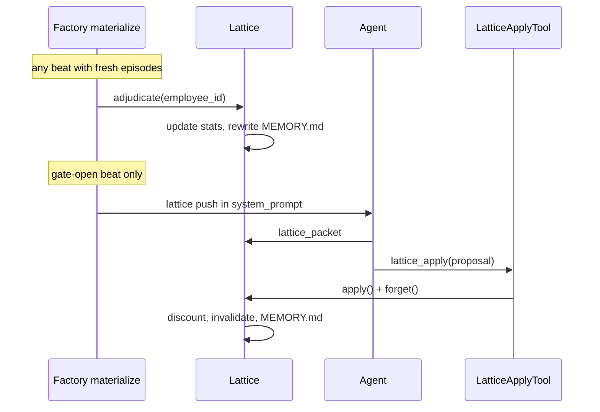

# PRD — Adjudication Sleep Beat (Lattice × Chorus)

**Source:** `.omx/specs/deep-interview-adjudication-build.md`  
**Branches:** lattice `feat/patterns-only`, chorus `feat/lattice-integration`  
**Status:** Consensus APPROVED (Planner + inline Architect/Critic review)  
**Plan path:** `.omx/plans/prd-adjudication-sleep-beat.md`

---

## RALPLAN-DR Summary

### Principles

1. **Prose proposes, outcomes dispose** — `c_p = 0`; claims are audit trail only.
2. **Lattice curates algebraically** — no LLM at adjudicate/forget layers.
3. **Per-employee isolation** — stats keyed by `employee_id`; cross-employee apply rejected (existing).
4. **Trust surface first** — MEMORY.md tier + LCB is primary done signal; retrieval reweight deferred.
5. **Harness owns sleep timing** — no new agent tools; infrastructure calls adjudicate/forget.

### Decision Drivers

1. Wrong-domain patterns must lose LCB when non-matching beats fail.
2. Full sleep scope on both repos (user rejected lattice-only).
3. Must not break v3 probe / E2E-14 non-blocking lattice semantics.

### Options Considered

| Option | Verdict |
|--------|---------|
| **A — Split lifecycle hooks (REVISED)** | **CHOSEN** — adjudicate@every materialize with fresh episodes; forget@post-apply in `LatticeApplyTool` |
| B — Single `facade.sleep_beat()` from scheduler | Rejected — agent apply is mid-beat |
| C — Lattice-only first | Rejected — interview scope |
| D — `forget@scheduler` when `gate_open` post-beat | **Rejected** — gate closes after apply; forget would never run |

---

## Architect Review (inline)

### Steelman antithesis

> "Don't split sleep across factory/scheduler/tools — add explicit `lattice_sleep(phase)` state machine in facade with a `last_sleep_phase` cursor. Agent tools stay dumb; scheduler drives phases by reading beat events."

**Counter:** Chorus already has beat-start injection and post-beat episodic capture. A phase state machine adds persistence and race conditions for marginal clarity. Accepting instead: **idempotent adjudicate on fresh episodes** + **forget immediately after successful apply** keeps ordering deterministic without new stores.

### Tradeoff tension

**Cross-domain β on every non-matching failed beat** vs **pattern stability**: a popular `api.retry` pattern on a large repo will accumulate β from unrelated failed beats across the codebase, potentially demoting useful patterns before enough same-domain α accrues. Mitigation: `w_cross=0.5` default (tunable); document in params; integration test asserts behavior.

### Synthesis

- Run **adjudicate whenever** `new_episodes(watermark) > 0` and active atoms exist — not only when gate open. This enables post-consolidation cross-domain demotion on beats 6+.
- Run **forget inside `LatticeApplyTool.execute`** after `apply()` succeeds — satisfies sleep ordering and fixes gate-closed bug.
- Optional **light forget** on scheduler post-beat only when no apply occurred (discount without invalidate) — defer to follow-up; v1 forget-on-apply only.

### Architect concerns addressed

| Concern | Fix |
|---------|-----|
| `invalidate()` drops stats in `memory_md.py:45-53` | Preserve `stats` field through invalidate path |
| `asdict(atom)` won't serialize nested stats | Custom `_atom_to_json` for `PatternStats` |
| Adjudicate only on gate-open misses post-apply episodes | Adjudicate on any materialize with fresh episodes |
| Forget gated on `gate_open` post-beat never fires | Forget hooks into successful `lattice_apply` |
| `key_files` from stale `source_run_ids` | Re-resolve from episodic reader at adjudicate time |

---

## Critic Review (inline)

**Verdict: APPROVE** (after revisions above)

| Criterion | Status |
|-----------|--------|
| Principle-option consistency | ✅ |
| Testable acceptance criteria | ✅ MEMORY.md snapshot, unit adjudicate, integration five-beat extension |
| Verification steps | ✅ listed per phase |
| Risk mitigation | ✅ w_cross, try/except E2E-14 |
| Shallow alternatives explored | ✅ B, C, D invalidated with rationale |

**Required test additions (Critic):**
1. `test_forget_runs_after_apply_not_gate_open` — apply closes gate, forget still invoked via tool
2. `test_adjudicate_runs_without_gate_open` — fresh episodes + active atoms triggers update
3. `test_memory_md_format_snapshot` — golden file for `[rule, LCB 0.72]` line

---

## Architecture



---

## Cross-domain β semantics

**Key files** = ⋃ `files_touched` from episodic records for `source_run_ids` (resolved at adjudicate time).

For each episode in `new_episodes(all, watermark)`:

| Overlap | Outcome | Δα / Δβ |
|---------|---------|---------|
| yes | `done` | α += 1 |
| yes | not `done` | β += 1 |
| no | not `done` | β += w_cross (default 0.5) |
| no | `done` | skip |

**Tier:** `rule` iff `(α+β) ≥ N_rule` and `LCB05(α,β) > θ*`; else `hint`.

---

## Implementation Phases

### Phase 1 — Domain + storage (lattice)

| File | Change |
|------|--------|
| `src/lattice/domain/stats.py` | `PatternStats`, `Tier`, `lcb05()` |
| `src/lattice/contracts/atom.py` | `stats: PatternStats \| None = None` |
| `src/lattice/stores/memory_md.py` | JSON stats round-trip; MEMORY.md `[tier, LCB x.xx]`; fix invalidate stats preservation |

### Phase 2 — Algebra (lattice)

| File | Change |
|------|--------|
| `src/lattice/adjudicate.py` | `adjudicate_employee()`, key_files resolver |
| `src/lattice/forget.py` | `forget_employee()` — discount + invalidate |
| `tests/test_adjudicate.py` | tier flip, cross-domain β, irrelevant beat skip |
| `tests/test_forget.py` | below θ_floor invalidation |

### Phase 3 — Facade (lattice)

| File | Change |
|------|--------|
| `src/lattice/facade.py` | `adjudicate()`, `forget()` public methods |
| `tests/integration/test_five_beat_consolidation.py` | post-apply MEMORY.md tier; cross-domain demotion path |

### Phase 4 — Chorus wire (chorus)

| File | Change |
|------|--------|
| `chorus_harness/_factory.py` | Before lattice push: `adjudicate(employee_id)` if fresh episodes (try/except) |
| `chorus_tools/_lattice.py` | `LatticeApplyTool`: after successful apply → `forget(employee_id)` |
| `tests/harness/test_lattice_sleep_wiring.py` | mock lattice; assert adjudicate at materialize, forget after apply |

**No scheduler change in v1** — forget-on-apply supersedes post-beat gate_open forget.

### Phase 5 — Verification

```bash
cd lattice && uv run pytest -q
cd chorus && uv run pytest tests/harness/test_lattice*.py tests/tools/test_lattice_tool.py -q
```

Optional smoke: backend engineer probe; inspect temp `lattice/bex/MEMORY.md`.

---

## Parameters

| Param | Value | Notes |
|-------|-------|-------|
| `N_rule` | 3 | design doc §10 |
| `θ*` | 0.6 | rule LCB bar |
| `θ_floor` | 0.3 | forget invalidation |
| `d` | 0.95 | per-apply discount |
| `w_cross` | 0.5 | **revised** — less aggressive than 1.0 |
| Jeffreys prior | α=β=0.5 | legacy atoms |

---

## Acceptance Criteria

- [ ] MEMORY.md: `- **api.retry** [hint, LCB 0.41]: ...` after adjudicate
- [ ] Same-domain 3× `done` → `[rule, LCB > 0.6]`
- [ ] Cross-domain non-done beats lower LCB (unit test)
- [ ] Forget removes atom below θ_floor after apply
- [ ] Adjudicate runs without gate open when fresh episodes exist
- [ ] Forget runs after apply when gate already closed
- [ ] 53+ lattice tests + new tests green
- [ ] Chorus lattice harness tests green; E2E-14 preserved

---

## ADR

**Decision:** Adjudicate at every factory materialize when fresh episodic deltas exist; forget immediately after successful `lattice_apply`; extend Atom with `PatternStats`; MEMORY.md renders tier + LCB.

**Drivers:** Wrong-domain retrieval trust; full sleep scope; gate-closed forget bug avoidance.

**Alternatives rejected:**
- Scheduler post-beat forget gated on `gate_open` (gate closes after apply)
- Lattice-only delivery (interview scope)
- Structural retrieval filter (deferred)
- Two-arm lift (explicit non-goal)

**Consequences:**
- `LatticeApplyTool` gains side effect (forget) — document in tool description
- Cross-domain β may demote aggressively — `w_cross=0.5` tunable
- `lattice_context` ranking unchanged until follow-up

**Follow-ups:** retrieve.py tier×LCB; structural `condition`; separate adjudication watermark if double-count bugs appear; multi-role probes.

---

## Execution Handoff

### `$ralph` (recommended for sequential cross-repo)

```text
$ralph .omx/plans/prd-adjudication-sleep-beat.md
```

| Step | Lane | Agent |
|------|------|-------|
| 1 | lattice Phases 1–3 | coder + python-reviewer |
| 2 | chorus Phase 4 | coder |
| 3 | verification | tester |

### `$team` (parallel)

```text
$team .omx/plans/prd-adjudication-sleep-beat.md
```

| Lane | Scope |
|------|-------|
| A | lattice adjudicate + forget algebra |
| B | atom stats + MEMORY.md |
| C | chorus factory + LatticeApplyTool |
| D | tests |

**Team verification:** all pytest green + MEMORY.md golden snapshot.  
**Ralph follow-up:** probe smoke; read `MEMORY.md` for tier/LCB.

---

## Changelog (consensus revisions)

- Fixed forget placement: `LatticeApplyTool` post-apply, not scheduler `gate_open`
- Adjudicate runs on fresh episodes regardless of gate state
- Added `w_cross=0.5` per Architect tradeoff analysis
- Added Critic-mandated tests for ordering bugs
- Preserved stats through invalidate path
