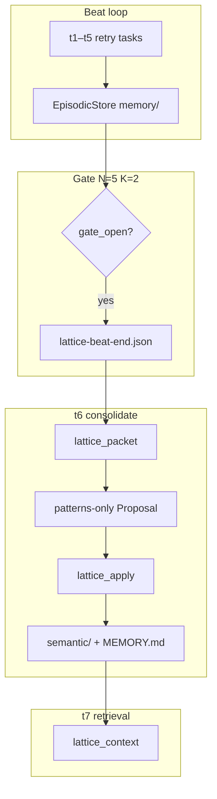

# Chorus × Lattice Skill Evolution: Integrable Plan

*Generated: July 11, 2026 | Updated: July 11, 2026 (Hermes granularity) | Builds on [procedural-memory-research.md](./procedural-memory-research.md), [hermes-skill-granularity-research.md](./hermes-skill-granularity-research.md) | Confidence: High*

## Executive Summary

**Lattice** (`feat/patterns-habits`) implements habit evolution with Hermes-aligned gates: `HabitDraft` validation (EVOLVE-first, diary rejection, CREATE rare), `OverlaySkillStore` with agentskills.io frontmatter, packet habit hints with `suggested_action=evolve`, and directives. **Chorus** (`feat/lattice-integration`) wires habits end-to-end: `enable_patches=True`, `habits[]` parsing, evolved-skills materialization, and backend_engineer e2e.

| Slice | Status |
|-------|--------|
| A — Bridge + parser | ✅ done |
| B — Evolved materialize | ✅ done |
| C — Hermes validation + hints | ✅ done |
| D — Consolidate skill docs | ✅ done |
| E — Probe t8 | deferred (programmatic e2e covers A+B) |

Routing follows Hermes + agentskills.io:

| Content | Store | Tool |
|---------|-------|------|
| Facts ("client retries 429/503") | **Patterns** | `lattice_context` |
| Procedure lessons | **Habit EVOLVE** into existing role skill | `skill` |
| Class-level new playbooks (rare) | **Habit CREATE** | `skill` |
| Session diary / one-off observations | **Episodic only** | `recall`, `get_run` — never promote |

**Critical rule** ([Hermes #12812](https://github.com/NousResearch/hermes-agent/issues/12812)): short sticky-note content must **not** become skills. Default habit action is **EVOLVE** (patch umbrella), not CREATE micro-slugs. See [hermes-skill-granularity-research.md](./hermes-skill-granularity-research.md).

---

## 1. Current State (As-Is)

### Data flow today (patterns only)



### Blocked in chorus

| Gap | File |
|-----|------|
| `enable_patches` not passed | `_lattice_bridge.py` |
| `habits[]` not parsed | `_lattice.py` |
| No `evolved-skills/` materialize | `_skills.py` |
| Weak habit validation (any non-empty body) | lattice `validate.py` |
| Habit hints suggest CREATE slugs from file prefix | lattice `cluster.py` |
| `lattice-consolidate` is patterns-only | `_lattice_skills/` |

---

## 2. Target State (Hermes-Aligned)

### Sticky note vs reference manual

> Reference document → skill. Sticky note → pattern ([Hermes docs](https://hermes-agent.nousresearch.com/docs/guides/work-with-skills)).

### Hermes preference ladder (habit authoring)

```
1. patterns[]           — facts that belong in lattice_context
2. habits EVOLVE        — patch section in existing role skill (DEFAULT)
3. habits CREATE        — new class-level umbrella ONLY (rare; structured body)
4. Nothing to save      — one-off narratives, diary entries, transient errors
```

**Do NOT capture as habits** ([background_review.py](https://github.com/NousResearch/hermes-agent/blob/main/agent/background_review.py), PR [#23004](https://github.com/NousResearch/hermes-agent/pull/23004)):

- One-off task narratives ("analyze this PR", "we found 86 calls today")
- Environment-specific transient failures
- Negative tool claims ("X doesn't work")
- Facts restated as procedures (belongs in `patterns[]`)

### Dual-store routing

| Question | Store | Tool | On disk |
|----------|-------|------|---------|
| What did we decide? | Semantic patterns | `lattice_context` | `semantic/`, `MEMORY.md` |
| How should I act on this class of task? | Evolved role skill | `skill` | `evolved-skills/<canonical-slug>/SKILL.md` |
| What happened on beat X? | Episodic | `recall`, `get_run` | `memory/` |

### Target data flow

```mermaid
flowchart TB
    subgraph consolidate [t6 gate open]
        LP[lattice_packet] --> HINTS{hints}
        HINTS -->|pattern| PAT[patterns[] facts]
        HINTS -->|habit evolve| EV[habits EVOLVE into role skill]
        PAT --> LA[lattice_apply]
        EV --> LA
        LA --> SEM[semantic/]
        LA --> OVL[evolved-skills/test-evidence/]
    end
    subgraph materialize [next beat]
        ROLE[canonical skills/] --> MERGE[merge evolved overlay by slug]
        OVL --> MERGE
        MERGE --> HS[.harness/skills/test-evidence/SKILL.md]
        HS --> SKILL[skill tool]
    end
```

### On-disk layout

```
{company_root}/lattice/{employee_id}/
  semantic/                         # facts
  MEMORY.md
  evolved-skills/
    test-evidence/                  # EVOLVE overlay (same slug as canonical role skill)
      SKILL.md                      # patched section content
  procedural-meta.json

{worktree}/.harness/skills/
  test-evidence/SKILL.md            # canonical + evolved overlay merged at materialize
  lattice-consolidate/
  lattice-context/
```

**Materialize semantics:** For EVOLVE, overlay lives under the **canonical skill slug** (`test-evidence`), not a new micro-slug. Factory copies evolved overlay **over** the canonical copy in worktree (Hermes: patch umbrella in place).

---

## 3. Integration Slices

### Slice A — Bridge + parser (chorus, ~0.5 day)

**Goal:** Lattice persists habits; `lattice_apply` accepts `habits[]`.

| Task | File | Change |
|------|------|--------|
| A1 | `_lattice_bridge.py` | `enable_patches=True`, `canonical_skills_root` params |
| A2 | `_factory.py` | Single `build_lattice_for_chorus` instance; pass `config.skills_root` |
| A3 | `_lattice.py` | Parse `habits[]`; `patterns OR habits` required; expose hint `kind`; report `patches_written` |

**Tests:** `test_lattice_tool.py` — EVOLVE proposal applies; validation errors surface.

---

### Slice B — Evolved-skills materialization (chorus, ~0.5 day)

**Goal:** Patched role skills load via `skill` tool on next beat.

| Task | File | Change |
|------|------|--------|
| B1 | `_skills.py` | `materialize_evolved_skills_into(skills_dir, company_root, employee_id)` |
| B2 | `_factory.py` | Call after `materialize_skills` + `materialize_lattice_skills_into` |
| B3 | `overlay_skills.py` (lattice) | agentskills.io frontmatter on CREATE; EVOLVE preserves target slug |

**Precedence:** Evolved overlay **replaces** worktree copy for matching slug. Canonical package source untouched.

**Tests:** `test_evolved_skills_materialize.py` — EVOLVE `test-evidence` overlay wins in worktree.

---

### Slice C — Hermes-aligned validation + hints (lattice, ~0.5 day)

**Goal:** Gate rejects micro-skills and diary entries; hints push EVOLVE not CREATE.

#### C1. Stricter `validate.py` gates

```python
MIN_HABIT_BODY_CHARS = 400          # CREATE only; EVOLVE section patch exempt
MIN_HABIT_CREATE_BODY_CHARS = 800   # class-level umbrella bar
REQUIRED_CREATE_SECTIONS = ("## When to Use", "## Pitfalls")  # or Verification
DIARY_PATTERNS = (r"\bwe found\b", r"\btoday\b", r"\bon \d{4}-\d{2}-\d{2}\b")
```

| Action | Rules |
|--------|-------|
| **EVOLVE** (default) | `skill` + `section` + non-empty `body`; `skill` must exist in `canonical_skills_root` OR prior `evolved-skills/`; body must not match diary patterns |
| **CREATE** (rare) | All EVOLVE rules + `slug`/`title`; slug ∉ canonical; `len(body) >= MIN_HABIT_CREATE_BODY_CHARS`; required sections present; slug must not be file-prefix derived (`src-api` rejected) |

Reject habit bodies that restate pattern facts without procedure ("retries 429/503" alone → use `patterns[]`).

#### C2. Smarter packet hints (`cluster.py`)

Current (too permissive):

```python
# Emits HABIT hint with CREATE slug from file prefix for every done cluster
_habit_slug(cluster)  # "src" → "src"
```

Target:

```python
# Habit hint only when cluster has procedural signal (e.g. multiple files touched OR intent variance)
# hint payload: kind=habit, action=evolve, skill=<nearest_canonical_slug>, section=<suggested>
# Do NOT emit habit hint when pattern hint alone suffices (retry policy = pattern only)
```

For retry probe cluster (`src/api/client.py` retries): emit **pattern hint only**. Emit **habit evolve hint** only when beats show multi-step debugging workflow (not just repeated implementation).

Add optional `PacketHint.suggested_action` / `suggested_skill` fields (or encode in `key_template` convention: `evolve:test-evidence`).

#### C3. Update `directive.py` + `lattice-consolidate` skill

**Preference order in consolidate workflow:**

1. `patterns[]` for facts
2. `habits EVOLVE` into loaded/nearest role skill
3. `habits CREATE` only for new class-level playbook (Overview, When to Use, Procedure, Pitfalls, Verification)
4. `'Nothing to save'` when only diary-level signal

**Tests (lattice):**

- `test_patterns_habits.py` — extend: reject short CREATE, accept EVOLVE
- `test_validate_habit_diaries.py` — new: diary bodies rejected
- `test_cluster_habit_hints.py` — new: retry cluster → pattern hint only

---

### Slice D — Agent guidance (chorus, ~0.5 day)

**Goal:** Chorus consolidate skill teaches Hermes routing.

**File:** `chorus_employee/_lattice_skills/lattice-consolidate/SKILL.md`

Add:

- Sticky note vs reference manual table
- Do NOT capture list (one-off narratives, transient errors)
- EVOLVE-first examples (patch `test-evidence`, not CREATE `retry-discipline`)
- CREATE example only as **class-level** template (800+ chars, required sections)
- Explicit: retry policy numbers → `patterns[]` only

Lattice does not keep a duplicate SKILL.md — chorus `_lattice_skills/` is authoritative.

Update `_lattice.py` `LatticeApplyInput` description.

---

### Slice E — E2E probe 5+3 (chorus, ~1 day)

**Goal:** Prove EVOLVE round-trip without micro-skill spam.

| Beat | Purpose |
|------|---------|
| t1–t5 | Retry cluster, open gate |
| t6 | `api.retry` **pattern** + **EVOLVE** `test-evidence` section (programmatic + agent path) |
| t7 | Pattern retrieval (unchanged) |
| **t8** | Load `test-evidence` via `skill`; verify evolved section present in materialized SKILL.md |

#### t8 checks

```python
def _t8_habit_checks(...):
    # company_root/lattice/{emp}/evolved-skills/test-evidence/SKILL.md exists
    # worktree/.harness/skills/test-evidence/SKILL.md contains "Before patching HTTP clients"
    # t8 trace: skill tool invoked with test-evidence (soft)
    # NOT checking for novel slug like retry-discipline
```

#### Programmatic t6 habit apply (deterministic)

```python
HabitDraft(
    action=HabitAction.EVOLVE,
    skill="test-evidence",
    section="Before patching HTTP clients",
    body="...",  # full procedure + pitfalls + verification (>= 400 chars)
    source_run_ids=(done_run_ids),
)
```

Do **not** use CREATE in probe — EVOLVE is the Hermes-aligned path.

Update `chorus/docs/lattice-5beat-checklist.md` → 5+3.

---

## 4. API Contract

### Canonical proposal (retry probe)

```json
{
  "employee_id": "e_be_1",
  "patterns": [{
    "key": "api.retry",
    "claim": "The HTTP client in src/api/client.py retries 429 and 503 responses up to 3 times with exponential backoff from 0.2s to 30s.",
    "source_run_ids": ["r1", "r2"]
  }],
  "habits": [{
    "action": "evolve",
    "skill": "test-evidence",
    "section": "Before patching HTTP clients",
    "body": "## Before patching HTTP clients\n\n1. `get_run(run_id)` for each cited beat — recall failure shape.\n2. Classify transient (429/503) vs logic error.\n3. Only then edit `src/api/client.py`.\n\n## Pitfalls\n- Patching without prior beat prose repeats the same mistake.\n\n## Verification\n- `test_evidence` passes after the patch.",
    "source_run_ids": ["r1", "r2"]
  }]
}
```

### Anti-patterns (reject at validate)

```json
{
  "habits": [{
    "action": "create",
    "slug": "retry-discipline",
    "title": "Retry discipline",
    "body": "Recall failure shape before patching."
  }]
}
```

Fails: body too short, missing sections, diary/sticky-note content, file-prefix slug.

### Validation matrix

| Rule | Patterns | Habits EVOLVE | Habits CREATE |
|------|----------|---------------|---------------|
| Cited runs exist | ✅ | ✅ | ✅ |
| ≥1 `outcome=done` | ✅ | ✅ | ✅ |
| Min body/claim | 20 chars claim | 400 chars | 800 chars + sections |
| Target exists | — | canonical or prior overlay | — |
| Slug collision | supersedes key | N/A (uses canonical slug) | slug ∉ canonical |
| Diary detection | — | ✅ | ✅ |
| Class-level name | — | — | no file-prefix / session slugs |

### Packet hints

| `kind` | When emitted | Agent action |
|--------|--------------|--------------|
| `pattern` | Recurring cluster | `patterns[]` claim |
| `habit` | Multi-step procedural signal only | `habits EVOLVE` into `suggested_skill` |
| (none) | Fact-only cluster (retry policy) | `patterns[]` only — no habit hint |

---

## 5. Factory refactor

Single `build_lattice_for_chorus` per materialize (today: duplicate at lines ~680 and ~746 in `_factory.py`).

---

## 6. Test matrix

| Test | Repo | Slice |
|------|------|-------|
| `test_habit_evolve_proposal_apply` | chorus | A |
| `test_reject_short_habit_create` | lattice | C |
| `test_reject_diary_habit_body` | lattice | C |
| `test_retry_cluster_pattern_only_hint` | lattice | C |
| `test_evolved_overlay_test_evidence` | chorus | B |
| `test_frontmatter_on_create` | lattice | B |
| `backend_engineer_lattice_probe` t8 | chorus | E |
| `test_patterns_habits` (update) | lattice | C |

---

## 7. PR sequence

1. **lattice** `feat/patterns-habits` — Slice C (validation + hints) + Slice B3 (frontmatter)
2. **chorus** `feat/lattice-habits` from `feat/lattice-integration`:
   - PR1: Slice A (bridge + parser)
   - PR2: Slice B (materialize)
   - PR3: Slice D + E (guidance + probe t8)

---

## 8. Deferred (post-M3)

| Item | Reference |
|------|-----------|
| `HabitAction.DELETE` + curator archival | Hermes curator, Memp lifecycle |
| True section-merge EVOLVE (not full file overwrite) | `overlay_skills.py` |
| `references/` support files under evolved skills | Hermes preference ladder step 3 |
| Offline GEPA on high-traffic skills | hermes-agent-self-evolution |
| Tool-call-count gate on habit hints | Hermes 5+ tool calls bar |

---

## 9. Risks & mitigations

| Risk | Mitigation |
|------|------------|
| Micro-skill spam | Slice C validation + EVOLVE-first hints |
| Facts in habits | Reject fact-only bodies; route to `patterns[]` |
| Diary entries as skills | Diary regex + Do NOT capture in consolidate skill |
| EVOLVE overwrites whole SKILL.md | Accept for M3; true merge deferred; EVOLVE targets section semantics in body |
| Agent ignores EVOLVE guidance | Programmatic t6 apply in probe |
| CREATE used when EVOLVE suffices | CREATE gates (800 chars, sections) |

---

## 10. Success criteria

M3 done when:

1. `enable_patches=True` + `patches_written > 0` on **EVOLVE** apply
2. `evolved-skills/test-evidence/SKILL.md` on disk (not a novel micro-slug)
3. Next beat materializes patched `test-evidence` into `.harness/skills/`
4. t8: `skill` tool loads `test-evidence` with evolved section
5. t7 + `retrieval_all_pass` + `context_design_excludes_retry` unchanged
6. Short CREATE proposals **rejected** by lattice validate

---

## 11. Key files

### Chorus

| File | Slice |
|------|-------|
| `chorus_tools/_lattice_bridge.py` | A |
| `chorus_tools/_lattice.py` | A, D |
| `chorus_harness/_factory.py` | A, B |
| `chorus_harness/_skills.py` | B |
| `chorus_employee/_lattice_skills/lattice-consolidate/SKILL.md` | D |
| `examples/backend_engineer_lattice_5beat_probe.py` | E |
| `docs/lattice-5beat-checklist.md` | E |

### Lattice

| File | Slice |
|------|-------|
| `src/lattice/validate.py` | C |
| `src/lattice/cluster.py` | C |
| `src/lattice/directive.py` | C |
| `src/lattice/stores/overlay_skills.py` | B |
| `tests/test_validate_habits.py` | C (new/extend) |

---

## Methodology

Chorus integration audit + [procedural-memory-research.md](./procedural-memory-research.md) + [hermes-skill-granularity-research.md](./hermes-skill-granularity-research.md). Plan revised after Hermes #12812 / background_review preference ladder: **EVOLVE-first, CREATE-rare, patterns-for-facts**.
