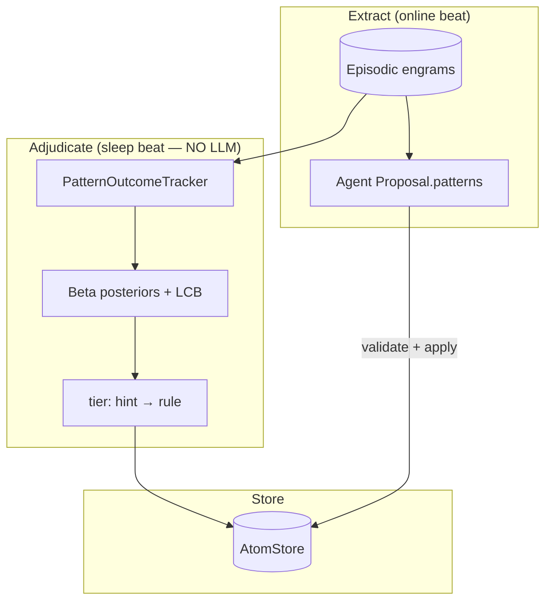

# Consolidation adjudication — non-LLM algorithms & Beta–Bernoulli finetune

**Design doc · Status: DRAFT v1 · 2026-07-10 · Owner: Divyansh · Branch:** `feat/patterns-only`

**Companions:**

- [v1-plan.md](v1-plan.md) — shipped patterns loop (gate → packet → validate → apply)
- [integration-plan.md](integration-plan.md) — chorus × lattice wiring
- Draft **Lattice v1 — Single-Employee Outcome-Grounded Learning** (2026-06-25) — full Beta–Bernoulli spine (belief / rule / hint)

**Research basis:** field survey (July 2026) of non-LLM consolidation systems, one reference algorithm (Mnemosyne), one Bayesian math reference (MACLA), mapped to shipped lattice code.

---

## Contents

1. [Problem & scope](#1-problem--scope)
2. [First principles (locked)](#2-first-principles-locked)
3. [Field landscape](#3-field-landscape)
4. [Reference: Mnemosyne (algorithmic consolidation)](#4-reference-mnemosyne-algorithmic-consolidation)
5. [Reference: MACLA (Bayesian math only)](#5-reference-macla-bayesian-math-only)
6. [Draft v1 vs shipped lattice](#6-draft-v1-vs-shipped-lattice)
7. [Target architecture](#7-target-architecture)
8. [Mathematical core (finetuned Beta–Bernoulli)](#8-mathematical-core-finetuned-betabernoulli)
9. [Implementation slices](#9-implementation-slices)
10. [Open parameters](#10-open-parameters)
11. [Non-goals & deferred seams](#11-non-goals--deferred-seams)
12. [Sources](#12-sources)

---

## 1. Problem & scope

### 1.1 What this doc decides

Shipped lattice (`feat/patterns-only`) already implements **non-LLM consolidation at the curation layer**:

- Agent authors `Proposal.patterns[]` from episodic prose + traces
- Lattice **validates** structure and **applies** atoms — never interprets language

What is **missing** relative to the 2026-06-25 draft is **outcome-grounded adjudication**: promoting, demoting, and forgetting patterns based on the employee's honest beat outcomes, not merely on agent assertion.

This doc specifies how to add that adjudication **without**:

- A lattice-owned LLM extractor
- Self-assigned confidence from worker prose
- Replacing the agent-author loop

### 1.2 Consolidation decomposition

Every memory system splits consolidation into three phases:

| Phase | Question | LLM-heavy field default | Lattice constraint |
|---|---|---|---|
| **Extract** | What candidate knowledge enters the room? | LLM summarize / segment trajectory | **Agent proposal** (dream beat) |
| **Adjudicate** | What becomes durable, at what tier? | LLM merge + self-confidence | **Outcome-grounded counts** (this doc) |
| **Forget** | What dies? | TTL, utility prune, decay | **Discount + supersede + invalidate** |



---

## 2. First principles (locked)

These inherit from the 2026-06-25 draft and [integration-plan.md](integration-plan.md) §1. They are not re-opened here.

| Invariant | Meaning |
|---|---|
| **Prose proposes, outcomes dispose** | Worker narrative is a hypothesis; durable promotion requires re-grounding against honest terminal outcomes |
| **Agent authors, lattice curates** | No lattice LLM that writes or merges pattern claims |
| **LLM may route, not adjudicate** | Cheap model may decide *delivery* of an already-corroborated rule; never assign confidence or write memory |
| **Own evidence for rule tier** | Priors (sibling pool) may lift hint score; only own fingerprint outcomes cross the rule gate |
| **Structural keying** | Fingerprint = hard `files_touched` overlap — prose is never parsed into a key |
| **CLS separation** | Consolidation runs on idle / sleep beats — never mid-implementation |

### 2.1 Critical finetune vs draft v1

In **agent-authored** mode, set **`c_p = 0`** (prose pseudo-vote weight).

The agent's `PatternDraft.claim` is already prose. Counting it again in `(α_prose, β_prose)` double-counts self-report and violates the honesty guarantee. Prose enters only as the atom's `value` (audit trail), not as evidence.

---

## 3. Field landscape

Survey target: consolidation **without structured LLM calls at the adjudicate layer** (July 2026).

| System | Extract | Adjudicate | Forget | LLM at consolidate? | Relevance |
|---|---|---|---|---|---|
| **Lattice shipped** | Agent proposal | `validate()` rules | `invalidate` / supersede | **No** | ✅ Current baseline |
| **Lattice draft v1** | 3 extractors | Beta–Bernoulli 2-arm | count decay `d` | Only if extractors use LLM | ⚠️ Adjudicate layer to port |
| **Mnemosyne** | Regex + 13 types | Veracity-weighted Bayes | per-type decay | **No** | ✅ Reference algo |
| **MACLA** | LLM segment | Beta + expected utility | utility prune | **Yes** | Math reference only |
| **FluxMem** | varies | **BMM fusion gate** | hierarchy | Partial | ✅ Gate upgrade |
| **elo-memory / EM-LLM** | surprise (KL) | schema replay | power-law decay | Background optional | ✅ Encode gate idea |
| **Mem0 / Hindsight** | LLM hierarchical | multi-signal RAG | temporal decay | **Yes** | ❌ Wrong epistemics |
| **Paperclip Hippocampus** | agent explicit save | keyword store | GC + survival | **No** | ✅ Sleep phase shape |

**Convergence:** the field splits into LLM-as-consolidator vs algorithm-as-consolidator. Lattice + chorus is firmly in the second camp; the missing piece is **Bayesian adjudication on top of agent-authored atoms**.

---

## 4. Reference: Mnemosyne (algorithmic consolidation)

**Primary reference** for zero-LLM-at-ingestion consolidation.

- Paper: [Mnemosyne PAPER_DRAFT.md](https://github.com/AxDSan/mnemosyne/blob/ed85e51255044ba70eb178879f50db097c43b702/PAPER_DRAFT.md)
- Claim: sub-10ms retrieval, 13 typed memory classes, veracity-weighted merge, automatic conflict resolution

### 4.1 Pipeline (all deterministic)

```text
episode text
  → typed classification (75 regex patterns)
  → gist + fact triple extraction (rule-based)
  → episodic graph edges
  → veracity-weighted merge
  → polyphonic recall (vector + graph + fact + temporal)
```

### 4.2 Consolidation math (portable)

**Veracity tiers** (provenance, not self-report):

| Tier | Weight |
|---|---|
| stated | 1.0 |
| inferred | 0.7 |
| tool | 0.5 |
| imported | 0.6 |
| unknown | 0.8 |

**Confidence update:**

```text
new_confidence = old + (1 - old) × veracity_weight × 0.3
```

**Conflict:** same `(subject, predicate)` + different `object` → higher confidence wins; loser marked superseded.

### 4.3 What lattice adopts from Mnemosyne

| Mnemosyne | Lattice mapping |
|---|---|
| Fact triples | Keyed patterns + structural `condition` (file overlap) |
| Veracity at ingest | Map chorus outcome + capture path → weight on first apply |
| Conflict = predicate collision | Auto-supersede: same `key` + overlapping condition + incompatible claim |
| Type-specific decay | Tier-specific decay on `(α_own, β_own)` |

**Do not adopt:** 13-type regex taxonomy wholesale — chorus already types outcomes (`done`, `incomplete`, `needs_changes`, …).

---

## 5. Reference: MACLA (Bayesian math only)

**Primary reference** for Beta–Bernoulli procedure learning math.

- Paper: [MACLA AAMAS 2026](https://arxiv.org/html/2512.18950v1)

### 5.1 Adopt (pure math)

1. **Beta posteriors** per pattern: `ρ ~ Beta(α, β)`; update on terminal outcome success/failure
2. **Two-arm lift:** model applied vs not-applied on same fingerprint; rule requires `P(lift > 0) > 0.95`
3. **Exploit-only cap:** patterns always followed never accumulate counterfactual arm → capped at hint (draft §5 handles this honestly)
4. **Utility prune:** `0.5·(α/(α+β)) + 0.3·freq + 0.2·recency` for bounded catalogues

### 5.2 Reject (uses LLM)

- Trajectory segmentation into procedures (§4.1)
- Contrastive refinement via LLM comparing success vs failure contexts (§4.3)
- Meta-procedure extraction via LLM

Agent proposal + episodic `files_touched` replace MACLA's extraction layer.

---

## 6. Draft v1 vs shipped lattice

### 6.1 Shipped (`src/lattice/cluster.py`, `validate.py`, `retrieve.py`)

```text
G(c) ⇔ |E_new| ≥ N ∧ max_cluster_size(E_new) ≥ K     # N=5, K=2 default

bucket_key = first_file_prefix OR first_intent_token OR run_id

rank: (outcome_rank, −created_at)   # done first

author: agent Proposal.patterns[]
validate: deterministic (key, claim length, provenance, supersede)
retrieve: 0.3·recency + 0.5·keyword_overlap + 0.2·activation
```

**Already non-LLM at lattice layer.** Gap: no outcome-verified tiers, no automatic promotion/demotion, retrieval is overlap-ish not structural key-match.

### 6.2 Draft v1 (2026-06-25) — not yet in code

```text
gather → mine hypotheses (pattern / one-off / contradiction)
adjudicate → Beta–Bernoulli two-arm lift on own history
forget → discount α_own, β_own per sleep cycle
retrieve → structural key-match; A+B coarse→fine over beat
epistemic stack → belief / rule / hint
```

### 6.3 Gap table

| Capability | Shipped | Draft v1 | This doc |
|---|---|---|---|
| Agent-authored patterns | ✅ | ✅ | keep |
| Gate on episode count + cluster | ✅ | ✅ | + optional BMM (Slice B) |
| Outcome-grounded posteriors | ❌ | ✅ | **Slice A** |
| hint / rule tiers | ❌ | ✅ | **Slice A** |
| Two-arm lift gate | ❌ | ✅ | **Slice A** |
| Sibling pooling `λ` | ❌ | ✅ | module-prefix pool in `cluster()` |
| Auto conflict supersede | partial (explicit) | ✅ | **Slice C** (Mnemosyne-style) |
| Structural retrieval timing | ❌ | ✅ | defer (retrieval doc) |
| Belief tier (immutable) | ❌ | ✅ | defer (founder seam) |

---

## 7. Target architecture

### 7.1 Division of labor (unchanged)

| Stage | Owner | Mechanism |
|---|---|---|
| WRITE episodic | chorus | beat-end capture → `EpisodicStore` |
| EXTRACT candidates | **agent** | `Proposal.patterns[]` on sleep beat |
| VALIDATE + APPLY | lattice | `validate_proposal` → `apply_proposal` |
| **ADJUDICATE tiers** | lattice | `PatternOutcomeTracker` (new, no LLM) |
| READ patterns | lattice | `context(query)` — later weighted by tier × LCB |
| READ episodic | chorus | `recall()` / `get_run()` |

### 7.2 Sleep beat phases (Paperclip shape, chorus-honest jobs)

| Phase | Draft name | Job | LLM? |
|---|---|---|---|
| slow-wave | **gather** | New deltas since cursor; rank; cluster; packet hints | No |
| REM | **adjudicate** | Update `(α, β)` per active atom; promote/demote tier; detect conflicts | No |
| homeostasis | **forget** | Discount counts; prune below `θ_floor`; compact redundant keys | No |

Agent **author** step sits between gather and apply (existing loop). Adjudicate runs **after** apply on subsequent sleep cycles — or on the same sleep beat **before** the agent sees the packet, so hints reflect current posteriors.

Recommended ordering on one sleep beat:

```text
1. gate_open?
2. adjudicate existing atoms (outcome scan since cursor)
3. packet(hints) → agent proposal
4. validate → apply
5. forget (discount all atoms)
6. advance cursor
```

### 7.3 Atom schema extension

Extend atom metadata (frontmatter / sidecar JSON — storage TBD):

```yaml
---
key: auth.session.store
value: "Auth sessions must use one shared store under auth/"
employee_id: bex
source_run_ids: [run-a, run-b, run-c]
tier: hint          # hint | rule  (belief deferred)
condition:
  files_overlap: "src/auth/**"   # structural partition variable
arms:
  applied:     { alpha_own: 3.0, beta_own: 0.0 }
  not_applied: { alpha_own: 0.7, beta_own: 1.0 }
prior:
  pool: { parent: "src/auth", lambda: 0.3, alpha: 0.6, beta: 0.4 }
posterior:
  mean: 0.77
  lcb05: 0.41
  p_lift_gt0: 0.62
invalid_at: null
---
```

`Atom` dataclass gains optional `tier` + `stats` sidecar; `MEMORY.md` view renders tier + LCB in teaser lines.

---

## 8. Mathematical core (finetuned Beta–Bernoulli)

Inherits draft §5 with one change: **`α_prose = β_prose = 0`** in agent-authored mode.

### 8.1 Posterior

```text
θ_H ~ Beta(α, β)

α = α_pool + α_own          # no α_prose
β = β_pool + β_own          # no β_prose

α_own = Σ decayed successes on fingerprint F
β_own = Σ decayed failures  on fingerprint F

α_pool = λ · α_parent
β_pool = λ · β_parent

λ = κ / (κ + Var_between_siblings)    # empirical Bayes on module-prefix siblings
```

### 8.2 Fingerprint match (only fuzzy step)

Reference class for adjudication:

```text
similar(F, delta) ⇔ |files_touched(delta) ∩ key_files(pattern)| > 0
```

Partition outcomes:

```text
applied arm:     pattern key matched AND agent files_touched overlap during beat
not_applied arm: matched fingerprint BUT pattern condition not satisfied
                 OR explicit skip observable (future exploration seam)
```

Terminal outcome mapping (chorus honest):

| `outcome` | Bernoulli trial |
|---|---|
| `done` | 1 |
| `incomplete`, `needs_changes`, `blocked`, errored | 0 |

### 8.3 Surfacing tiers

```text
hint_score = LCB_5%( Beta(α, β) )

rule_eligible ⇔ (α_own + β_own) ≥ N_rule
              ∧ LCB_5%( Beta(α_own, β_own) ) > θ*
              ∧ P(lift > 0) > 0.95
```

Rule gate reads **own evidence only** — pool priors never cross the rule line.

### 8.4 Forgetting

Each sleep cycle:

```text
α_own ← d · α_own
β_own ← d · β_own        # d ≈ 0.95

beliefs (future): d = 1  # never decay
```

Atoms with `hint_score < θ_floor` after discount → `invalidate()`.

### 8.5 Mnemosyne-style conflict (Slice C)

Before `validate_proposal`:

```text
conflict(pattern P, active atom A) ⇔
  P.key = A.key
  AND condition_overlap(P, A)
  AND claims_incompatible(P.claim, A.value)
  AND LCB(P) > LCB(A)

→ require P.supersedes = A.key (or auto-inject supersede)
```

`claims_incompatible` v1: normalized string inequality on same key + condition — no LLM. v2: structural field mismatch on parsed condition dict.

### 8.6 FluxMem-style gate (Slice B, optional)

Upgrade `gate_open`:

```text
G(c) ⇔ |E_new| ≥ N
     ∧ max_cluster_size ≥ K
     ∧ P_BMM(outcomes_in_largest_cluster = consolidatable) > τ
```

Two-component Beta Mixture on per-cluster outcome rates — replaces brittle "cluster exists" with "cluster has signal."

---

## 9. Implementation slices

| Slice | Deliverable | Module(s) | Tests |
|---|---|---|---|
| **A** | `PatternOutcomeTracker` — scan episodic deltas, update arms, compute LCB + tier | `lattice/adjudicate.py` | unit: synthetic episodes → tier flip |
| **A** | Wire into `facade` sleep path before/after apply | `facade.py` | integration: `test_five_beat_consolidation.py` |
| **B** | BMM gate (optional) | `cluster.py` | unit: noise cluster rejected |
| **C** | Auto-supersede preflight in validate | `validate.py` | unit: conflict → supersede required |
| **D** | Retrieval weights tier × LCB × overlap | `retrieve.py` | unit: rule outranks hint |
| defer | Semantic divergence check (draft §7.5 iii) | — | needs cheap LLM — not v1 |
| defer | Exploration budget (counterfactual harvest) | — | seam |
| defer | Hebbian prefetch graph | — | seam |

### 9.1 Gate (TDD)

```bash
uv run pytest tests/test_adjudicate.py tests/integration/test_five_beat_consolidation.py -q
```

Red first:

- Pattern with 3 own successes + high LCB → tier `rule`
- Pattern always applied, never skipped → stays `hint` (lift gate fails)
- After discount, weak hint → invalidated

---

## 10. Open parameters

| Param | Meaning | Starting guess | Source |
|---|---|---|---|
| `c_p` | prose pseudo-vote | **0** (agent-authored) | this doc §2.1 |
| `λ` | sibling transfer discount | `κ/(κ+Var)` | draft §5 |
| `N_rule` | min own trials for rule | 3 | draft §13; MACLA |
| `θ*` | own-only LCB bar for rule | 0.6 | draft §13 |
| `θ_floor` | min hint_score to keep atom | 0.3 | draft §13 |
| `d` | per-sleep decay on own counts | 0.95 | draft §13 |
| `P(lift>0)` | rule certification | 0.95 | draft §13; MACLA |
| `N`, `K` | consolidation gate | 5, 2 | [v1-plan.md](v1-plan.md) §6.1 |
| `τ` | BMM gate threshold | 0.7 | tune on probe |

Tune on chorus `backend_engineer_memory_integration_probe` — metric: **patterns cited on resume beats that predict done outcomes**.

---

## 11. Non-goals & deferred seams

**Non-goals (this doc):**

- Lattice-owned LLM extractors or merge synthesis
- Vector DB as primary consolidation substrate
- Multi-employee credit propagation (org graph seam)
- Horizon "what" outcome (external strategic signal)
- Replacing agent-authored proposals with automatic hypothesis mining

**Deferred seams (from draft §12):**

- **Belief tier** — founder-ratified immutable rules
- **Hebbian coupling graph** — prefetch only, navigational
- **Exploration budget** — occasional not-following hint on low-stakes beats
- **Semantic divergence check** — LLM routes delivery, not truth
- **Horizontal scope axis** — individual → role → company

---

## 12. Sources

1. Lattice draft v1 — Single-Employee Outcome-Grounded Learning (2026-06-25, internal)
2. [v1-plan.md](v1-plan.md) — shipped patterns loop
3. [integration-plan.md](integration-plan.md) — chorus seam
4. [Mnemosyne PAPER_DRAFT](https://github.com/AxDSan/mnemosyne/blob/ed85e51255044ba70eb178879f50db097c43b702/PAPER_DRAFT.md) — veracity Bayes, zero LLM ingest
5. [MACLA AAMAS 2026](https://arxiv.org/html/2512.18950v1) — Beta–Bernoulli + lift (math only)
6. [FluxMem ICML 2026](https://arxiv.org/html/2602.14038v1) — BMM fusion gate
7. [Zylos agent memory survey 2026](https://zylos.ai/research/2026-04-05-ai-agent-memory-architectures-persistent-knowledge/)
8. [Mem0 state of memory 2026](https://mem0.ai/blog/state-of-ai-agent-memory-2026) — benchmarks
9. [SCM sleep-consolidated memory](https://arxiv.org/html/2604.20943v1) — importance + forgetting
10. [elo-memory / EM-LLM](https://pypi.org/project/elo-memory/) — surprise-gated encoding
11. [Paperclip agent memories PR #3289](https://github.com/paperclipai/paperclip/pull/3289) — explicit save + keyword recall

---

**Summary:** Keep shipped lattice's agent-author loop. Add draft v1's Beta–Bernoulli as a **deterministic sleep adjudicator** over atoms (Mnemosyne conflict resolution + MACLA lift gate), with **`c_p = 0`**. Extract stays with the agent; truth stays with outcomes.
