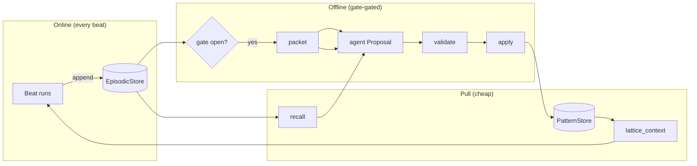
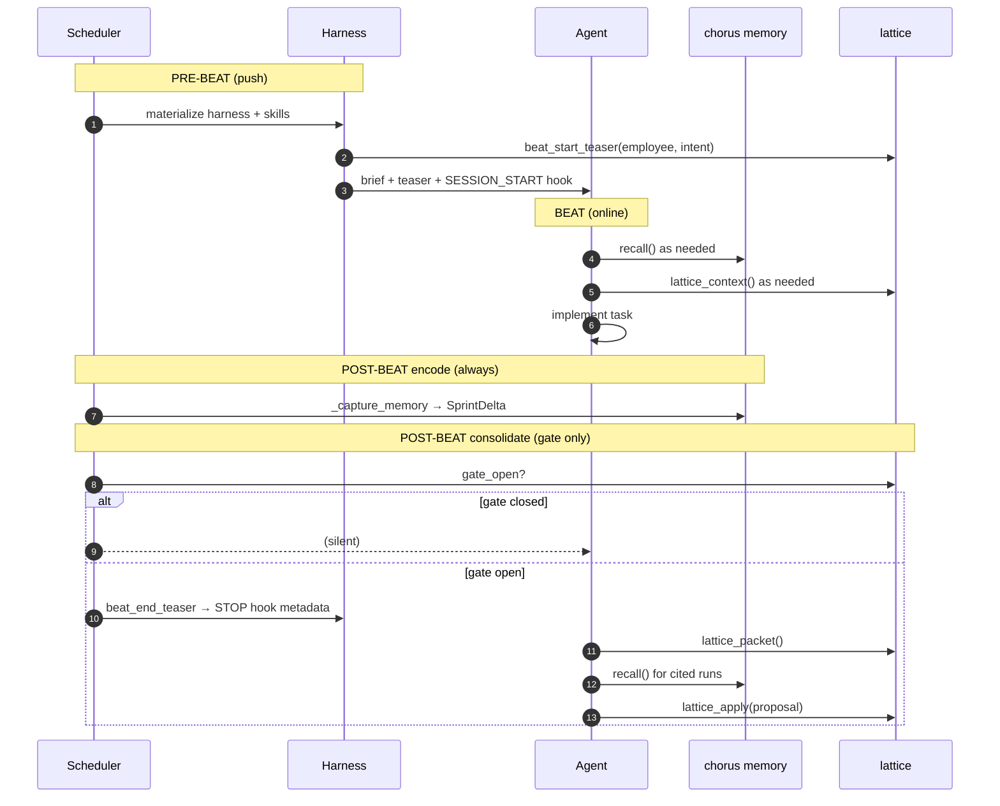

# Consolidation system — lattice × chorus integration plan

**Branch:** `feat/patterns-only` · **Companion:** [v1-plan.md](v1-plan.md) · [consolidation-adjudication-design.md](consolidation-adjudication-design.md)

> *Episodic memory is the hippocampus — fast, verbatim, forgetful unless replayed.*  
> *Pattern memory is cortex — slow to form, compact, durable.*  
> *Greplica taught us: the agent writes; the algebra validates and applies.*

This document is the **cross-repo plan**: what lattice owns, what chorus wires, and how employees experience consolidation through hooks, tools, and skills — without lattice importing chorus.

---

## 0. One picture



| Phase | Neuroscience analogue | Greplica analogue | Cost |
|---|---|---|---|
| Beat execution | encoding | — | normal |
| `recall()` | hippocampal retrieval | episodic search | cheap |
| `lattice_context()` | cortical pattern completion | graph context (read) | cheap |
| Consolidate | systems consolidation (sleep) | update-working-memory | **expensive** |

---

## 1. First principles

### 1.1 Greplica (engineering)

| Principle | Meaning here | Anti-pattern |
|---|---|---|
| **Agent authors** | Employee writes `Proposal.patterns[]` from prose + traces | Lattice LLM extractor |
| **Validate → apply** | Deterministic rules; atomic writes | Two-arm critic before first atom |
| **Hooks at boundaries** | SESSION_START push teaser; STOP enqueue packet hint | Inline consolidation every beat |
| **Skills teach timing** | When to call tools; not every turn | Tool without skill/directive |
| **Pull vs push** | Raw episodes pulled; patterns pushed lightly | Dump episodic catalogue into prompt |

### 1.2 Neuroscience (design vocabulary only — not code module names)

| Concept | lattice construct | chorus construct |
|---|---|---|
| **Episodic trace** | reads `RawEpisode` | `SprintDelta` / `EpisodicStore` |
| **Semantic fact** | `Pattern` → `Atom` | — (lattice store) |
| **Recurrence gate** | `gate_open(N, K)` | — (RecMem: consolidate after repeated activation) |
| **Offline consolidation** | `packet` + `apply` at beat end | `_capture_memory` already ran (encode) |
| **Pattern completion** | `context(query)` score | — |
| **Reconsolidation** | `supersedes` on active key | — |
| **Procedural memory** | `Habit` (deferred on `main`) | evolved skills |

**CLS rule:** learning (online beats) and consolidation (offline lattice) are **separate phases**. Never interleave expensive consolidation mid-implementation.

---

## 2. Memory tiers in the employee beat

```text
┌─────────────────────────────────────────────────────────────┐
│  WORKING MEMORY (dream)     in-beat scratchpad, cleared     │
├─────────────────────────────────────────────────────────────┤
│  EPISODIC (chorus)          every beat append, full prose   │
│    read: recall()             pull, outcome-attached        │
├─────────────────────────────────────────────────────────────┤
│  SEMANTIC (lattice)         gate-gated pattern promotion    │
│    read: lattice_context()    push teaser, provenance       │
└─────────────────────────────────────────────────────────────┘
```

| Question | Tool | When |
|---|---|---|
| What did I try last time? | `recall()` | mid-beat / beat-start resume |
| What is durably true? | `lattice_context(query)` | beat-start, targeted |
| What should I promote? | `lattice_packet` + consolidate skill | beat-end, **gate open only** |

---

## 3. Repo seam (non-negotiable)

```text
dream  ←  chorus  ←  composition root  →  lattice
                ↑                              ↑
           mechanism                      policy
           EpisodicStore                  validate/apply
           recall tool                    pattern store
           scheduler                      gate algebra
```

| Rule | Detail |
|---|---|
| **No sideways import** | `src/lattice/` never imports `chorus` |
| **One adapter** | `lattice/examples/chorus_bridge.py` → copy to `chorus_tools/_lattice_bridge.py` or `examples/` |
| **One composition root** | `EmployeeHarnessFactory` constructs `Lattice` + registers tools |
| **Shared substrate** | Same `EpisodicStore` path: `company_root/memory` |

### Composition root sketch (chorus — to implement)

```python
# chorus_harness/_factory.py (composition root)
from lattice.compose import build_default
from lattice.examples.chorus_bridge import ChorusEpisodicReader  # or chorus_tools adapter

store = EpisodicStore(self._company_root / "memory")
lattice = build_default(
    consolidated_root=self._company_root / "lattice",
    episodes=ChorusEpisodicReader(store),
)
# register LatticeContextTool, LatticePacketTool, LatticeApplyTool(lattice)
# materialize lattice skills into worktree alongside role skills
```

---

## 4. Beat lifecycle — full wiring



### 4.1 Pre-beat — push channel (cheap)

**Owner:** `EmployeeHarnessFactory` + optional dream `Hook(SESSION_START)`

| Injection | Source | Max size |
|---|---|---|
| Role brief | existing | — |
| `RECALL_DIRECTIVE` | `chorus_employee/_recall.py` | exists |
| `LATTICE_CONTEXT_DIRECTIVE` | `lattice.directive` | 3 lines |
| Pattern teaser | `lattice.beat_start_teaser(employee, task.intent)` | ~400 chars |
| Lattice skills | merge `chorus_employee/_lattice_skills/` into `.harness/skills/` | read-only (chorus-owned) |

**Neuroscience:** pattern completion — surface relevant cortical traces before encoding new episodic content.

**Greplica:** SESSION_START ambient context (distilled), not raw graph dump.

### 4.2 Mid-beat — pull channel (cheap)

| Tool | Registered in | Identity |
|---|---|---|
| `recall` | factory (exists) | `RecallTool(EpisodicStore)` |
| `lattice_context` | factory (new) | `LatticeContextTool(lattice)` |

Employee id from `BeatContext.read(working_dir)` — same seam as recall.

### 4.3 Post-beat — encode (always, cheap)

Already live: `scheduler._capture_memory` → `EpisodicStore.append`.

**No lattice work here.** Encoding must never fail the beat.

### 4.4 Post-beat — consolidate (gate-gated, expensive)

**Not automatic in v1.** Two acceptable triggers (pick one for P1, defer the other):

| Trigger | Mechanism | Greplica |
|---|---|---|
| **A — Teaser + agent** | Scheduler writes teaser file; agent runs consolidate skill before beat ends | STOP metadata |
| **B — Next beat start** | If gate was open, first turn nudge on following beat | SESSION_START follow-up |

**Recommended P1:** Trigger **A** via `.harness/lattice-beat-end.json` written by scheduler after `_capture_memory`, read by brief/directive — agent consolidates in same beat only when teaser present. Avoid background worker until P2.

```json
{
  "gate_open": true,
  "teaser": "**Lattice gate open** — pattern consolidation is due…",
  "employee_id": "e_be_1",
  "run_id": "r_abc"
}
```

---

## 5. Dream hooks (employee-facing)

Implement as `dream.contracts.Hook` plugins registered in the harness — **observer only** (`allow_block=False`).

| Event | Hook | Payload | Effect |
|---|---|---|---|
| `SESSION_START` | `LatticeSessionStartHook` | `{teaser, intent}` | append teaser to session context |
| `STOP` | `LatticeStopHook` | `{gate_open, teaser}` | if open, inject consolidate reminder in hook feedback (non-blocking) |

```python
@dataclass(frozen=True)
class LatticeStopHook:
    spec: HookSpec = HookSpec(events=(HookEvent.STOP,), priority=10)

    async def __call__(self, event: HookEvent, payload: dict[str, Any]) -> HookResult:
        teaser = payload.get("lattice_teaser", "")
        if not teaser:
            return HookResult()
        return HookResult(feedback=teaser)  # non-blocking nudge
```

**Principle:** hooks **signal**; tools **act**. Agent still calls `lattice_apply` — lattice never LLM-writes patterns.

---

## 6. chorus_tools — three lattice tools

New module: `src/chorus_tools/_lattice.py` (mirrors `_recall.py` shape).

| Tool | Input | Behavior |
|---|---|---|
| `lattice_context` | `query: str`, `limit?: int` | `lattice.context(employee_id, query)` |
| `lattice_packet` | — | `lattice.packet(employee_id)` → JSON engrams + hints |
| `lattice_apply` | `proposal: dict` | parse → `Proposal` → `lattice.apply` → errors or ok |

**Security:** `employee_id` from `BeatContext`, never from model args (same as recall).

**Validate internal:** no separate `lattice_validate` tool in P1.

### Tool descriptions (agent-facing)

```python
# lattice_context — "Distilled patterns for this employee. Each hit lists src: run_ids — recall() for beat detail."
# lattice_packet — "Consolidation evidence bundle when gate is open. Empty/error if gate closed."
# lattice_apply — "Apply a patterns-only Proposal JSON. Gate should be open; validate runs inside."
```

---

## 7. Employee manifest changes

Add to **every employee** with episodic memory (all 6+ roles):

```python
# roles/_manifest.py tools tuple
("recall", "lattice_context", "lattice_packet", "lattice_apply", ...)
```

### Brief append (via factory, not hand-editing every `_brief.py`)

```python
config = replace(
    config,
    system_prompt=config.system_prompt
    + "\n\n"
    + RECALL_DIRECTIVE
    + "\n"
    + LATTICE_CONTEXT_DIRECTIVE
    + "\n"
    + LATTICE_CONSOLIDATE_DIRECTIVE,
)
```

Optional: role-specific one-liner in `_brief.py` only when needed.

### Skills materialization

```python
def _materialize_all_skills(root: Path, role_skills: Path, lattice_skills: Path) -> Path:
    dest = root / ".harness" / "skills"
    # copy role bundle + chorus `_lattice_skills/` (lattice-context, lattice-consolidate)
    ...
```

---

## 8. Storage layout (company root)

```text
company_root/
  memory/                          # chorus episodic (ground truth)
    <employee_id>/
      <run_id>.json
  lattice/                         # lattice consolidated (patterns)
    <employee_id>/
      semantic/*.json
      MEMORY.md                    # view
    .cursor.json                   # consolidation watermark
```

**Provenance chain:**

```text
Pattern.claim  ──source_run_ids──►  memory/<employee_id>/<run_id>
                                         ▲
                                    recall() reads here
```

---

## 9. Pattern contract (agent + validate)

Already in lattice v1 — repeated here because chorus agents must author to spec:

```json
{
  "employee_id": "e_be_1",
  "patterns": [{
    "key": "api.retry",
    "claim": "HTTP client retries use exponential backoff capped at 30s; config in src/api/client.py",
    "source_run_ids": ["r_done_1", "r_done_2"],
    "supersedes": null
  }]
}
```

| Field | Rule |
|---|---|
| `claim` | 1–2 sentences, ≥20 chars, constraint/scope/path |
| `source_run_ids` | ≥1 valid id; rendered at retrieval |
| `key` | hierarchical lowercase |

Retrieval output (lattice):

```markdown
- **api.retry**: HTTP retries use exponential backoff capped at 30s
  src: r_done_1, r_done_2 — get_run(run_id) for full beat prose
```

---

## 10. Implementation phases

### Phase L — lattice (`feat/patterns-only`)

| ID | Task | Status |
|---|---|---|
| L0 | gate, packet, validate, apply, context | ✅ |
| L0.1 | provenance render + claim depth | ✅ |
| L1 | `ChorusEpisodicReader` integration test | ⬜ |
| L2 | export `build_lattice_for_chorus(company_root)` helper | ⬜ |

### Phase C — chorus (new branch off `Chorus-employees`)

| ID | Task | Files |
|---|---|---|
| C1 | `chorus_tools/_lattice.py` — three tools | new |
| C2 | `chorus_tools/_lattice_bridge.py` — adapter (move from lattice example) | new |
| C3 | Factory: construct `Lattice`, register tools | `_factory.py` |
| C4 | Factory: append lattice directives to brief | `_factory.py` |
| C5 | Factory: merge lattice skills into materialize | `_factory.py`, `_skills.py` |
| C6 | Scheduler: write `.harness/lattice-beat-end.json` after capture | `_scheduler.py` |
| C7 | Optional: `LatticeSessionStartHook` / `LatticeStopHook` | `chorus_harness/_hooks.py` |
| C8 | Role manifests: add 3 lattice tools | each role manifest |
| C9 | Tests: tool isolation, employee_id binding, gate-closed no-op | `tests/tools/`, `tests/harness/` |
| C10 | E2E: 5 synthetic beats → gate opens → apply → context hit | `tests/integration/` |

### Phase M — merge

| ID | Task |
|---|---|
| M1 | Merge `feat/patterns-only` → lattice `main` |
| M2 | Merge chorus integration PR |
| M3 | Merge habits from lattice `main` (procedural — later) |

---

## 11. Test matrix

| Test | Asserts |
|---|---|
| Import graph | lattice package never imports chorus |
| Adapter | `ChorusEpisodicReader` satisfies `EpisodicReader` |
| Tool identity | `lattice_apply` rejects cross-employee ids |
| Gate closed | `lattice_packet` empty; no teaser file |
| Gate open | teaser written; packet has hints + engrams |
| Round trip | apply → `lattice_context` shows pattern + src |
| Recall link | cited `run_id` exists in `EpisodicStore` |
| Cost | consolidate not invoked when gate closed (mock apply) |

---

## 12. Explicitly deferred

| Item | Why |
|---|---|
| Background consolidate worker | Manual/agent path first (Greplica) |
| `lattice_validate` tool | validate inside apply |
| Habits / evolved skills | patterns-only branch |
| Embeddings index | BM25/overlap suffices P1 |
| FTS5 on patterns | atom count low initially |
| MemoryWriter swap (spec L1) | episodic stays append-only; lattice is sidecar store |
| Two-arm promotion critic | validate rules enough for v1 |
| Push raw episodic into prompt | unbounded noise |

---

## 13. Success criteria (P1 done)

1. Backend engineer runs **5 beats** on a recurring task cluster.  
2. Gate opens; beat-end teaser appears **once**.  
3. Agent (or test harness) submits valid `Proposal`; `lattice_apply` succeeds.  
4. Beat 6: `lattice_context("…")` returns pattern with `src:` ids.  
5. `get_run(run_id)` retrieves cited beat prose (`recall(query)` for slim search first).  
6. No consolidation on beats 1–4 (gate closed).  
7. Import graph clean; beat never fails because lattice threw.

---

## 14. References

| Doc | Repo |
|---|---|
| [v1-plan.md](v1-plan.md) | lattice — pattern algebra |
| [patterns-only.md](patterns-only.md) | lattice — branch scope |
| `docs/specs/divo/07-memory.md` | chorus — memory seam |
| `docs/superpowers/specs/2026-07-08-episodic-per-agent-record-design.md` | chorus — episodic + recall |
| `chorus_employee/_lattice_skills/` | chorus — `lattice-context` / `lattice-consolidate` playbooks |
| `dream/contracts/hook.py` | dream — hook events |

---

*The agent remembers what happened (recall). The org remembers what mattered (patterns). Lattice tells them when to sleep.*
