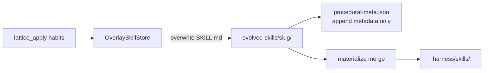
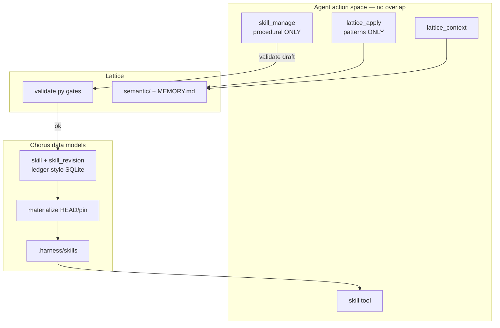
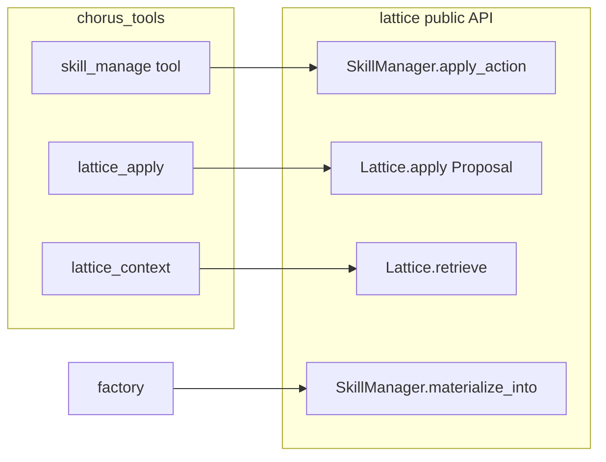
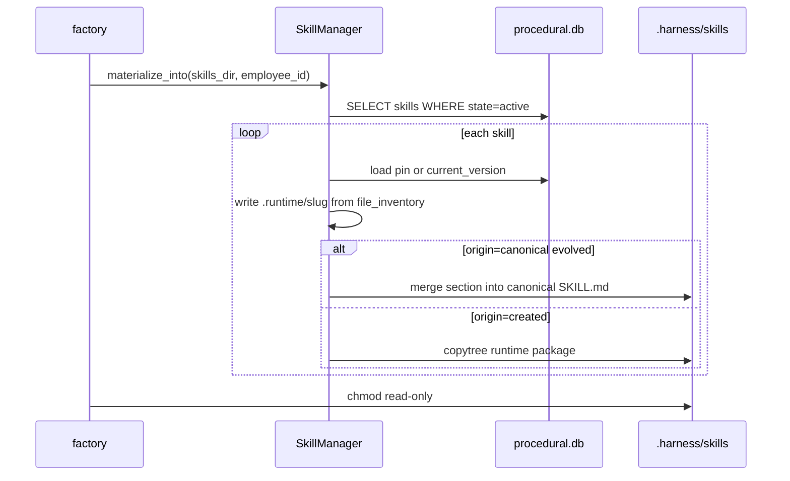
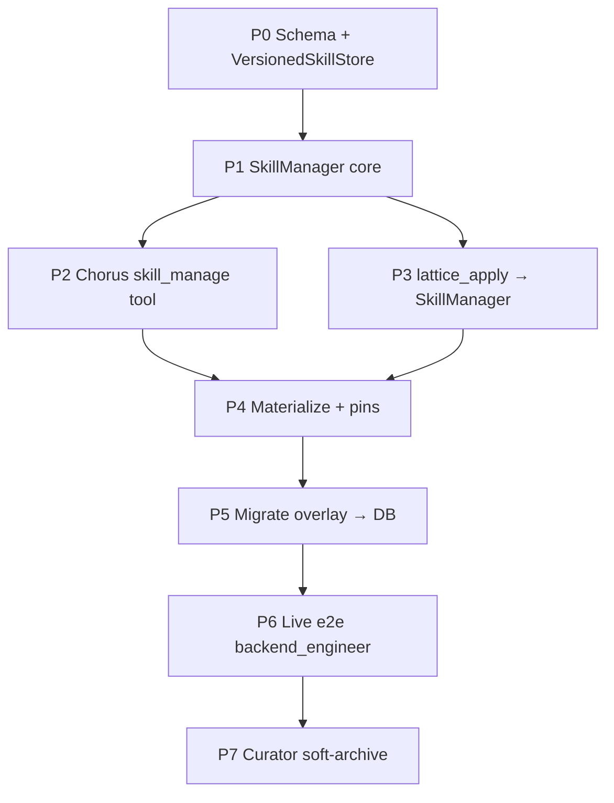

# Skill Manager Harness Plan

*Lattice × Chorus · Hermes process + Paperclip versioning · Harness-first*  
*Generated: July 11, 2026 · Builds on [chorus-skill-evolution-plan.md](./chorus-skill-evolution-plan.md), [hermes-skill-granularity-research.md](../research/hermes-skill-granularity-research.md), live scans of [hermes-agent](https://github.com/nousresearch/hermes-agent) + [paperclip](https://github.com/paperclipai/paperclip)*

---

## North star

> **Procedural memory that agents can patch like Hermes, version like Paperclip, and load like Dream — without sticky-note skill spam.**

| Layer | Owns | Does not own |
|-------|------|--------------|
| **Lattice** | Hermes gates (`validate.py`) · semantic atoms · habit *draft* types · retrieve facts | Skill version rows · SQLite procedural SoT · agent tools |
| **Chorus** | `skill` / `skill_revision` data models · `skill_manage` tool · materialize · pins · episodic | Pattern atom semantics |

> **Correction (Jul 11):** Do **not** dual-write via `lattice_apply(habits)` + `skill_manage`. Do **not** put `skill_versions` in Lattice — Chorus already versions with `routine_revision` / `artifact_revision`; procedural skills follow that pattern.

**Steal matrix (from `/tmp/skill-evolution-scan/`):**

| Steal from | What | Why |
|------------|------|-----|
| **Hermes** `skill_manage` | Action space: `create` / `patch` / `edit` / `delete` / `write_file` | Agents already know this shape; patch-first granularity |
| **Hermes** curator + provenance | `created_by`, eligibility, archive not hard-delete | Safe auto-maintenance without touching hub/canonical |
| **Hermes** gates | 5+ tool calls, diary reject, EVOLVE-first | Prevents #12812 sticky-note skills |
| **Paperclip** | `skills` + `skill_versions` append-only snapshots | Real history; restore = new revision; pin by `version_id` |
| **Paperclip** | Materialize `__runtime__` / pinned version dirs | Adapters need filesystem; DB is SoT |
| **Neither** | Frontmatter `version:` as runtime truth | Docs-only in Hermes; ignore for Lattice |

---

## 1. Problem with today (Slices A–D)



| Gap | Impact |
|-----|--------|
| No revision chain | Cannot rollback a bad EVOLVE; cannot pin employee to known-good body |
| Overlay write ≠ section patch | Store dumps full stub; merge only at materialize |
| No runtime `skill_manage` | Agent can only batch-propose on sleep beat via `lattice_apply` |
| No procedural GC | Evolved skills never archive; `forget` is semantic-only |
| No harness observation contract | Errors are strings; weak `next_actions` |

---

## 2. Target architecture (corrected)

### 2.0 Conflict resolution: one write path per memory kind

| Memory | Sole write tool | Sole read tools |
|--------|-----------------|-----------------|
| Semantic (facts) | `lattice_apply` **patterns[] only** | `lattice_context` |
| Procedural (skills) | `skill_manage` only | `skill`, `skill_manage(view)` |
| Episodic | beat runner / memory writer | `recall`, `get_run` |

**`lattice_apply` drops `habits[]` as a mutation surface** (or accepts them only as a deprecated shim that forwards once into `skill_manage` internals — never two agent-visible writers).

Sleep-beat consolidate skill becomes:

```
1. lattice_apply({ patterns: [...] })     # facts
2. skill_manage({ action: "patch"|… })    # procedures
3. Never invent micro-skills / diary
```



### Storage layout (Chorus-owned versioning)

Follow existing Chorus revision pattern (`routine_revision`, `artifact_revision`) — **not** a Lattice `procedural.db`.

```
{company_root}/
  memory/episodic.db              # Chorus episodic (unchanged)
  ledger.db  (or company ledger)  # Chorus — add skill / skill_revision
  lattice/{employee_id}/
    semantic/                     # Lattice facts only
    MEMORY.md
  worktrees/{emp}/.harness/skills/  # materialized from Chorus skill HEAD
```

Optional FS cache under company root is Chorus-owned (same as Paperclip `__runtime__`), not Lattice SoT.

---

## 3. Harness design (action · observation · recovery · budget)

### 3.1 Action space — `skill_manage` (Lattice-owned, Chorus-wrapped)

Stable, narrow, Hermes-compatible names. **One tool**, not five overlapping ones.

| Action | Risk | Granularity | When |
|--------|------|-------------|------|
| `view` | none | micro | Progressive disclosure (list → body → support file) |
| `patch` | medium | **preferred** | Section / fuzzy find-replace on HEAD |
| `edit` | high | macro | Full SKILL.md rewrite (major overhaul only) |
| `create` | high | macro | Class-level umbrella only (Hermes CREATE gates) |
| `write_file` | medium | medium | `references/` · `templates/` · `scripts/` · `assets/` |
| `remove_file` | medium | medium | Drop support file |
| `delete` | critical | micro | Soft-archive (curator) or hard-delete (explicit) |

**Keep `lattice_apply` for sleep-beat batch proposals** (patterns + habits).  
`skill_manage` is the **foreground / mid-beat** procedural CRUD surface — same validation, same version store.

```
Preference ladder (unchanged):
  patterns[]  →  skill_manage(patch)  →  skill_manage(create)  →  nothing
```

### 3.2 Observation contract (every tool response)

```json
{
  "status": "success | warning | error",
  "summary": "one-line result",
  "next_actions": ["patch section X", "call lattice_context for facts"],
  "artifacts": {
    "skill": "structuring-any-service",
    "version_id": "uuid",
    "revision_number": 3,
    "path": ".harness/skills/structuring-any-service/SKILL.md"
  },
  "root_cause": null,
  "retry": null,
  "stop": null
}
```

| Path | Must include |
|------|--------------|
| **error** | `root_cause` · `retry` · `stop` · `next_actions` |
| **warning** | e.g. body near size limit; suggest `write_file` to `references/` |
| **success** | `version_id` + `revision_number` always on mutating actions |

### 3.3 Error recovery examples

| Failure | root_cause | retry | stop |
|---------|------------|-------|------|
| Diary body | sticky-note / session narrative | rewrite as procedure or use `patterns[]` | do not CREATE |
| CREATE too short | <500 chars / missing sections | expand with When to Use + Pitfalls | — |
| EVOLVE unknown skill | slug not in canonical ∪ DB | `view` list / pick role skill | do not invent micro-slug |
| Patch no match | fuzzy miss | `view` current body, adjust `old_string` | after 2 misses → `edit` |
| Pin missing version | version_id deleted/archived | pin `null` (HEAD) or list versions | — |

### 3.4 Context budget

| In system prompt | On demand |
|------------------|-----------|
| Tool schemas + 1-line preference ladder | Full skill bodies via `skill` / `skill_manage(view)` |
| Gate teaser (N done beats) | `lattice_packet` hints |
| — | Version history via `skill_manage(view, revision=N)` |

Do **not** inject all evolved skill bodies into the system prompt.

---

## 4. Schema (Chorus ledger · mirror routine_revision)

**Owner: Chorus** — same append-only discipline as `routine_revision` / `artifact_revision`.

```sql
-- HEAD registry (employee-scoped skill)
CREATE TABLE skill (
  id                  TEXT PRIMARY KEY,
  employee_id         TEXT NOT NULL REFERENCES employee(id),
  slug                TEXT NOT NULL,
  name                TEXT NOT NULL,
  description         TEXT NOT NULL DEFAULT '',
  when_to_use         TEXT NOT NULL DEFAULT '',
  origin              TEXT NOT NULL,  -- canonical | evolved | created
  canonical_slug      TEXT,
  latest_revision_id  TEXT,           -- soft FK → skill_revision.id
  state               TEXT NOT NULL DEFAULT 'active',
  created_by          TEXT,
  curation_eligible   INTEGER NOT NULL DEFAULT 0,
  pinned              INTEGER NOT NULL DEFAULT 0,
  use_count           INTEGER NOT NULL DEFAULT 0,
  view_count          INTEGER NOT NULL DEFAULT 0,
  patch_count         INTEGER NOT NULL DEFAULT 0,
  last_used_at        TEXT,
  last_patched_at     TEXT,
  created_at          TEXT NOT NULL,
  updated_at          TEXT NOT NULL,
  UNIQUE (employee_id, slug)
);

-- Append-only (never UPDATE content) — same spirit as routine_revision
CREATE TABLE skill_revision (
  id                         TEXT PRIMARY KEY,
  skill_id                   TEXT NOT NULL REFERENCES skill(id) ON DELETE CASCADE,
  revision_no                INTEGER NOT NULL,
  label                      TEXT,
  action                     TEXT NOT NULL,  -- create|patch|edit|write_file|restore|delete
  file_inventory             TEXT NOT NULL,  -- JSON full snapshot
  content_hash               TEXT NOT NULL,
  source_run_ids             TEXT NOT NULL DEFAULT '[]',
  author_run_id              TEXT,
  restored_from_revision_id  TEXT,           -- like routine_revision
  created_at                 TEXT NOT NULL,
  UNIQUE (skill_id, revision_no)
);

CREATE TABLE skill_pin (
  employee_id  TEXT NOT NULL,
  slug         TEXT NOT NULL,
  revision_id  TEXT,  -- NULL = live HEAD (latest_revision_id)
  updated_at   TEXT NOT NULL,
  PRIMARY KEY (employee_id, slug)
);
```

Lattice keeps **only** `validate_habit_draft(...)` / `HabitDraft` types — no skill tables.

---

## 5. Lattice ↔ Chorus boundaries



| Concern | Lattice | Chorus |
|---------|---------|--------|
| Fuzzy patch / frontmatter validate | ✅ | wrap only |
| Hermes CREATE/EVOLVE gates | ✅ `validate.py` | surface errors as harness obs |
| SQLite open path | ✅ `procedural.db` under company lattice root | pass `company_root` |
| Merge into Dream worktree | ✅ `materialize_into(skills_dir, pins?)` | call from factory |
| Episodic `source_run_ids` | validates via reader port | provides `ChorusEpisodicReader` |
| Role skill discovery | reads `canonical_skills_root` | passes path from factory |

**Deprecate (after cutover):** `OverlaySkillStore` full-file overwrite as SoT. Keep as **read-migration** shim for existing `evolved-skills/` trees → import into DB as revision 1.

---

## 6. `skill_manage` tool schema (Chorus)

```python
# Pseudocode — final Zod/JSON schema in chorus_tools/_skill_manage.py
{
  "name": "skill_manage",
  "description": (
    "Procedural memory CRUD. Prefer patch over create. "
    "Facts → lattice_context / lattice_apply patterns[]. "
    "Never save diary sticky notes as skills."
  ),
  "parameters": {
    "action": "view|create|patch|edit|delete|write_file|remove_file|list_versions|restore",
    "name": "slug",
    "content": "full SKILL.md (create|edit)",
    "old_string": "patch",
    "new_string": "patch",
    "section": "optional heading hint for EVOLVE provenance",
    "file_path": "references/… relative",
    "version_id": "restore | pin target",
    "label": "optional revision label",
    "source_run_ids": ["r0", "r1"],
  }
}
```

**Routing inside Lattice `SkillManager`:**

| action | maps to |
|--------|---------|
| `create` | `HabitAction.CREATE` gates → version 1 |
| `patch` / `edit` | EVOLVE gates → new revision |
| `delete` | soft `state=archived` (+ optional hard purge flag) |
| `restore` | copy version inventory → new HEAD revision |
| `view` / `list_versions` | read-only; bump `view_count` |

Sleep-beat `lattice_apply(habits=[…])` becomes a **thin batch caller** of the same `SkillManager` — one code path.

---

## 7. Materialize + pin semantics



| Case | Behavior |
|------|----------|
| EVOLVE of role skill | Keep Dream `when_to_use` frontmatter; append/replace `## section` from version body |
| CREATE umbrella | Full package from inventory |
| Pin set | Materialize pinned `version_id`, not HEAD |
| Idempotent | Same inventory hash → skip write |

Fixes the live-e2e failure mode: **never replace canonical skill with a stub overlay.**

---

## 8. Curator / GC (Hermes-inspired, Phase 2)

| Rule | Behavior |
|------|----------|
| Eligibility | `curation_eligible=1` only if `created_by=agent` (background) |
| Never touch | `origin=canonical` base packages; hub-imported; `pinned=1` |
| Stale | `use_count=0` ∧ age > N days → `state=stale` |
| Archive | Move to `state=archived`; keep versions for restore |
| Consolidate | LLM pass suggests merge into umbrella via `patch` + `delete(absorbed_into=…)` |
| Backup | Optional: dump `procedural.db` snapshot before curator run |

Out of scope for Phase 1 — schema fields land early so Phase 2 is additive.

---

## 9. Construction slices (TDD · harness-first)



### P0 — Schema + store (Lattice)

**Goal:** SQLite SoT with append-only versions; FS cache optional.

| Task | Exit criteria |
|------|---------------|
| `stores/procedural_db.py` open/migrate | schema v1 applied |
| `create_skill` / `apply_patch` / `restore` | each bumps `revision_number` |
| Tests: round-trip inventory, unique revision, restore ≠ rewrite | green |

```bash
cd lattice && uv run pytest tests/test_procedural_db.py -q
```

### P1 — SkillManager + Hermes gates

**Goal:** Single API used by tools and batch apply.

| Task | Exit criteria |
|------|---------------|
| `SkillManager.apply_action(...)` | harness-shaped result dict |
| Reuse `validate.py` for create/patch | diary / short CREATE rejected |
| Fuzzy patch (port Hermes `fuzzy_match` or thin equiv) | patch miss → recovery fields |

```bash
uv run pytest tests/test_skill_manager.py tests/test_validate_habits.py -q
```

### P2 — Chorus `skill_manage` tool

**Goal:** Agent-facing tool with observation contract.

| Task | Exit criteria |
|------|---------------|
| Register tool on roles that may evolve skills | backend_engineer has it |
| Error paths include `next_actions` | unit tests assert keys |
| `view` progressive disclosure | list vs body |

```bash
cd chorus && uv run pytest tests/tools/test_skill_manage.py -q
```

### P3 — `lattice_apply` habits → SkillManager

**Goal:** One mutation path; deprecate overlay write as SoT.

| Task | Exit criteria |
|------|---------------|
| `habits[]` EVOLVE/CREATE call SkillManager | `patches_written` / `versions_created` in obs |
| Existing slice-A tests still pass | green |

### P4 — Materialize HEAD + pins

**Goal:** Factory loads Dream-compatible skills from DB.

| Task | Exit criteria |
|------|---------------|
| Replace overlay-only merge with DB materialize | `when_to_use` preserved |
| Optional pin in factory | pinned revision loads |
| Update `test_materialize_evolved_skills_into_worktree` | merge semantics |

### P5 — Migration shim

**Goal:** Existing `evolved-skills/**` → revision 1 rows.

| Task | Exit criteria |
|------|---------------|
| `migrate_overlays_to_db(employee_id)` | idempotent |
| Keep reading overlays if DB empty (compat) | one release |

### P6 — Live e2e (real backend_engineer)

**Goal:** Azure beat proves versioned EVOLVE + skill load + pattern retrieve.

Reuse `examples/backend_engineer_lattice_habit_live_e2e.py`:

| Hard gate | Soft gate |
|-----------|-----------|
| programmatic apply creates `revision_number≥1` | agent called `skill` / `skill_manage(view)` |
| materialized skill has evolved section + Dream frontmatter | `lattice_context` called |
| README RETRY_POLICY written | — |
| report JSON `all_pass` | `soft_pass` |

```bash
CHORUS_PROBE_BEAT_TIMEOUT_S=180 CHORUS_PROBE_MAX_TICKS=3 \
  uv run python examples/backend_engineer_lattice_habit_live_e2e.py
```

### P7 — Curator (later)

Soft-archive + eligibility; no auto hard-delete.

---

## 10. Anti-patterns (do not ship)

| Anti-pattern | Instead |
|--------------|---------|
| New micro-tool per verb (`skill_patch`, `skill_create`, …) | One `skill_manage` |
| Opaque `"error: failed"` strings | Harness observation contract |
| Frontmatter `version:` as SoT | `skill_versions.revision_number` |
| Replace canonical SKILL.md with stub overlay | Section-merge materialize |
| CREATE from file-prefix clusters (`src-api`) | EVOLVE role umbrella |
| Diary sticky notes as skills | `patterns[]` or episodic only |
| Postgres for Lattice v1 | SQLite beside episodic |
| Rewrite version rows on restore | Append new revision |
| Inject all skill bodies into system prompt | Progressive `view` / `skill` |
| Curator mutating hub/canonical | Eligibility flags |

---

## 11. Success metrics (harness benchmarking)

| Metric | Target (Slice P6) |
|--------|-------------------|
| Programmatic EVOLVE → version row | 100% |
| Materialize Dream-loadable | 100% |
| Live beat hard gates | pass |
| Soft: skill + lattice_context | ≥1/2 |
| Bad CREATE rejection (diary/short) | 100% in unit tests |
| Retries per live task | ≤ `_MAX_TICKS` |

---

## 12. File map (planned)

**Lattice**

| Path | Role |
|------|------|
| `src/lattice/stores/procedural_db.py` | SQLite schema + CRUD |
| `src/lattice/skill_manager.py` | Hermes-shaped action dispatcher |
| `src/lattice/stores/overlay_skills.py` | migrate-only / deprecate |
| `src/lattice/validate.py` | unchanged gates (shared) |
| `src/lattice/compose.py` | wire VersionedSkillStore |
| `tests/test_procedural_db.py` | TDD |
| `tests/test_skill_manager.py` | TDD |

**Chorus**

| Path | Role |
|------|------|
| `src/chorus_tools/_skill_manage.py` | tool + observation shaping |
| `src/chorus_tools/_lattice.py` | habits → SkillManager |
| `src/chorus_tools/_lattice_bridge.py` | open procedural.db |
| `src/chorus_harness/_skills.py` | DB materialize |
| `src/chorus_harness/_factory.py` | call materialize |
| `examples/backend_engineer_lattice_habit_live_e2e.py` | assert version_id |
| `tests/tools/test_skill_manage.py` | TDD |

**Clones for reference (already local)**

- `/tmp/skill-evolution-scan/hermes-agent/tools/skill_manager_tool.py`
- `/tmp/skill-evolution-scan/paperclip/packages/db/src/schema/company_skills.ts`
- `/tmp/skill-evolution-scan/paperclip/server/src/services/company-skills.ts`

---

## 13. Decision log

| Decision | Choice | Rationale |
|----------|--------|-----------|
| Procedural SoT | **Chorus `skill` / `skill_revision`** | Matches `routine_revision`; company/employee domain |
| Lattice role | **Validate only** for habits | No dual ownership of version rows |
| Agent writes | **`skill_manage` sole procedural writer** | Avoid overlap with `lattice_apply` |
| `lattice_apply` | **patterns[] only** | Semantic facts; habits removed from surface |
| Version model | Append-only + `restored_from_revision_id` | Same as Chorus routines |
| Materialize | Chorus factory | Dream worktree is Chorus concern |
| Phase 1 curator | Schema fields only | Ship versioning before GC |

---

## 14. Immediate next step

**Start P0** with TDD: empty `procedural.db` → create → patch → assert `revision_number == 2` → restore v1 → assert `revision_number == 3` and HEAD body matches v1.

Say the word and implementation begins at P0.
