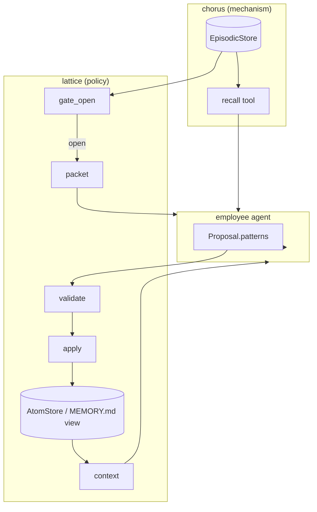
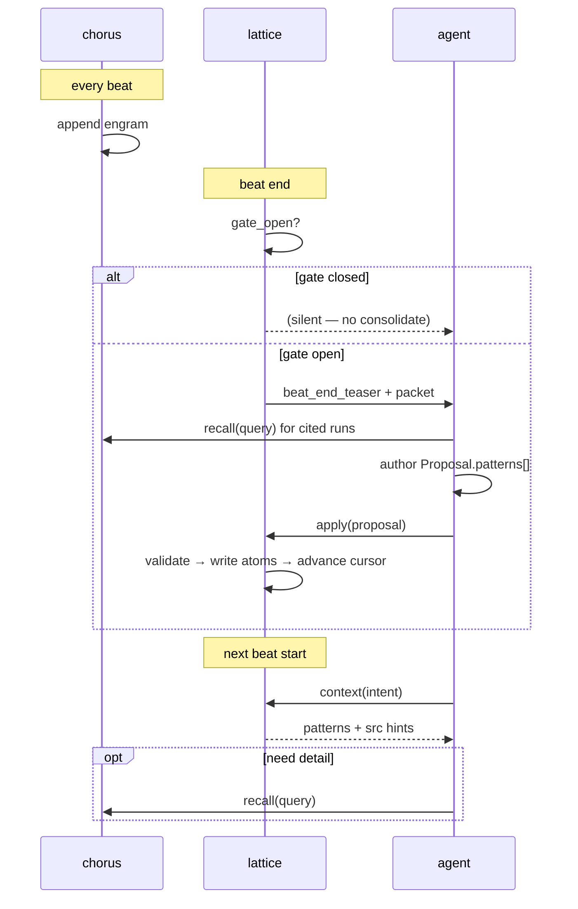

# lattice v1 — design spec

**Status:** `feat/patterns-only` · semantic **patterns** in scope · **habits** deferred (live on `main`).

**North star:** chorus appends engrams; lattice ranks evidence, validates agent proposals, stores patterns, retrieves by score; the employee agent is the only author. No lattice-owned LLM extractors.

---

## 1. Problem

Episodic memory (full beat prose) is cheap to append but expensive to re-read every beat. Agents need:

1. **Consolidation** — promote recurring evidence into durable facts
2. **Creation** — write those facts with provenance
3. **Retrieval** — pull the right facts at beat-start without re-scanning all history

Patterns are the semantic-memory construct for (1–3). Habits (procedural skill evolution) are additive on `main` and merge after patterns are proven.

---

## 2. Memory tiers

| Tier | Construct | Owner | Write | Read | Size |
|---|---|---|---|---|---|
| **Episodic** | Engram (`RawEpisode`) | chorus | every beat (automatic) | `recall()` / `recall(query)` | KB / beat |
| **Semantic** | Pattern (`Atom`) | lattice | gate-gated consolidate | `lattice_context(query)` | bytes–hundreds of bytes |

**Compression is intentional.** A pattern is an index + summary, not a copy of episodic prose. Ground truth stays in chorus; patterns cite it via `source_run_ids`.

```
many engrams  ──consolidate──►  few patterns  ──context──►  agent orientation
       ▲                              │
       └──────── recall drill-down ───┘
```

---

## 3. THE LOOP — ownership

| Stage | Owner | Mechanism |
|---|---|---|
| WRITE | chorus | append engram at beat end |
| STORE | chorus | `EpisodicStore` (SQLite) |
| RETRIEVE (pull) | chorus | `recall()` tool |
| RANK | lattice | `rank()` + `cluster()` |
| GATE | lattice | `gate_open()` |
| PACKET | lattice | `packet()` + hints |
| AUTHOR | agent | `Proposal.patterns[]` JSON |
| VALIDATE | lattice | `validate()` — deterministic rules |
| APPLY | lattice | `apply()` — atom store |
| CONTEXT | lattice | `context(query)` — scored retrieval |

**Division of labor:** agent reads prose and writes claims; lattice never interprets language — it validates structure and applies writes.

---

## 4. Architecture



**Seam rule:** lattice never imports chorus. `examples/chorus_bridge.py` is the only composition-root adapter (`ChorusEpisodicReader`).

---

## 5. Public API — five functions

Everything else is implementation detail.

```text
gate_open(employee_id)  → bool
packet(employee_id)       → Packet | ∅
validate(proposal)        → ValidationResult
apply(proposal)           → ApplyResult
context(employee_id, q)   → markdown patterns
```

Helpers for harness wiring:

```text
beat_end_teaser(employee_id)    → str   # silent when gate closed
beat_start_teaser(employee_id, q) → str   # top patterns for intent
```

---

## 6. Math spec

### 6.1 Gate (single function)

```text
G(c) ⇔ |E_new| ≥ N  ∧  max_cluster_size(E_new) ≥ K
```

| Symbol | Meaning | Default |
|---|---|---|
| `E_new` | engrams since cursor (`total − episodes_seen`) | — |
| `N` | min new beats before consolidate | 5 |
| `K` | min cluster size | 2 |

No OR-chain of alternate triggers. One gate, tunable via `build_default(min_new_episodes=…)`.

### 6.2 Rank

Within a batch, sort key:

```text
(outcome_rank, −created_at)
  outcome_rank = 0 if done else 1
```

Done beats surface first; recency breaks ties.

### 6.3 Cluster

Greedy bucket on primary feature:

```text
bucket_key = first_file_prefix  OR  first_intent_token  OR  run_id
```

Clusters feed packet hints — not writes.

### 6.4 Packet hints

```text
hints = { (key_template, run_ids) : |cluster| ≥ K }
```

`key_template` suggests a pattern key namespace (e.g. `src` → `api.retry`).

### 6.5 Retrieval score

```text
score(q, p) = w_r·recency(p) + w_b·overlap(q, p.key + p.claim) + w_a·activation(p)
```

| Weight | Default | Role |
|---|---|---|
| `w_r` | 0.3 | exponential decay, 14-day half-life |
| `w_b` | 0.5 | token overlap with query |
| `w_a` | 0.2 | activation (future: bump on context hit) |

Return top‑k active patterns rendered as markdown.

---

## 7. Construct: Pattern

### 7.1 Agent-facing type

```python
@dataclass(frozen=True)
class PatternDraft:
    key: str
    claim: str
    source_run_ids: tuple[str, ...]
    supersedes: str | None = None
```

```python
@dataclass(frozen=True)
class Proposal:
    employee_id: str
    patterns: tuple[PatternDraft, ...]
```

### 7.2 Stored type (`Atom`)

```python
@dataclass(frozen=True)
class Atom:
    key: str
    value: str              # claim text
    employee_id: str
    source_run_ids: tuple[str, ...]
    created_at: datetime
    invalid_at: datetime | None = None
    activation: float = 1.0
```

**Storage layout:**

```text
<consolidated_root>/<employee_id>/
  semantic/<key>.json     # source of truth
  MEMORY.md               # regenerated view
.cursor.json              # consolidation watermark
```

### 7.3 Claim authoring

Patterns stay small; claims must still be **agent-useful**.

| Quality | Example |
|---|---|
| **Rejected** (too short) | `"exponential backoff"` |
| **Good** | `"HTTP retries use exponential backoff capped at 30s; config in src/api/client.py"` |

Rules:

- 1–2 sentences
- Include constraint, scope, or file path when relevant
- Min **20 characters** (validated)
- Never verbatim episodic prose

### 7.4 Provenance

Every pattern **must** cite ≥1 `source_run_id` that exists for the employee. Validation rejects unknown ids.

At retrieval, context renders provenance so agents can drill down:

```markdown
## lattice patterns

- **api.retry**: HTTP retries use exponential backoff capped at 30s
  src: r_done_1, r_done_2 — recall(query='…') for beat detail
```

**Two-channel read model:**

| Need | Tool |
|---|---|
| Durable fact / calibration | `lattice_context(query)` |
| What happened, files, prose | `recall()` / `recall(query)` |

---

## 8. Consolidation flow



---

## 9. Validate / apply

### 9.1 Compile (internal)

```text
PatternDraft (no supersedes) → OpKind.ASSERT
PatternDraft (supersedes)    → OpKind.SUPERSEDE
```

Agent never sees ops — only `patterns[]`.

### 9.2 Validation rules (v1)

1. `|patterns| ≥ 1` and `|patterns| ≤ L` (default L = 20)
2. Every pattern cites ≥1 valid `source_run_id` for this employee
3. Key matches `^[a-z][a-z0-9_.]+$`
4. Claim length ≥ 20 chars after strip
5. New key → must not be active; update → must set `supersedes` to an active key

### 9.3 Apply

- `ASSERT` → write atom
- `SUPERSEDE` → set `invalid_at` on old key, write new atom
- Advance cursor on success
- No DELETE in v1

---

## 10. Beat cost policy

| When | Action | Cost |
|---|---|---|
| Every beat | chorus engram append | cheap |
| Beat start | optional `lattice_context` | cheap read |
| Mid-beat | `recall()` | cheap read |
| Beat end, gate **closed** | **nothing** | free |
| Beat end, gate **open** | consolidate skill → packet → proposal → apply | **expensive** |

Default: consolidate roughly every **5 beats** when a **recurring cluster** exists — not every beat.

---

## 11. Agent skills & tools

Materialize `skills/` into `.harness/skills/` (same as role skills).

| Skill | Tools | When |
|---|---|---|
| `lattice-context` | `lattice_context` | Beat-start — patterns for current intent |
| `lattice-consolidate` | `lattice_packet`, `lattice_apply` | Beat-end — **only** when gate open |

Brief directives (composition root): `LATTICE_CONTEXT_DIRECTIVE`, `LATTICE_CONSOLIDATE_DIRECTIVE` in `lattice.directive`.

### Proposal JSON (agent contract)

```json
{
  "employee_id": "e_be_1",
  "patterns": [
    {
      "key": "api.retry",
      "claim": "HTTP client retries use exponential backoff capped at 30s; see src/api/client.py",
      "source_run_ids": ["r_done_1", "r_done_2"],
      "supersedes": null
    }
  ]
}
```

---

## 12. Package map

```text
src/lattice/
  contracts/       EpisodicReader, AtomStore, ConsolidationCursor
  domain/          PatternDraft, Proposal, Packet, ValidationResult, ApplyResult
  cluster.py       gate, rank, cluster, build_hints
  compile.py       PatternDraft → internal ops
  validate.py      deterministic rules
  apply.py         atom writes
  retrieve.py      score + context render (with provenance)
  stores/          MemoryMdStore, JsonCursorStore
  directive.py     harness brief snippets
  facade.py        Lattice (five functions)
  compose.py       build_default()
examples/
  chorus_bridge.py composition-root adapter (only chorus import)
skills/
  lattice-context/ lattice-consolidate/
```

---

## 13. Milestones

### This branch (`feat/patterns-only`)

| ID | Delivers | Status |
|---|---|---|
| **P0** | gate, packet, validate, apply, context | done |
| **P0.1** | claim depth validation + provenance in context render | done |
| **P1** | `ChorusEpisodicReader` seam test against real chorus | next |
| **P1.1** | chorus tools: `lattice_context`, `lattice_packet`, `lattice_apply` | next |
| **P1.2** | harness: skills materialize + beat-end teaser injection | next |
| **P2** | activation bump on context hit; tune retrieval weights | planned |
| **P3** | optional embeddings over pattern keys+claims | deferred |

### After patterns proven — merge from `main`

| ID | Delivers |
|---|---|
| **H1** | `HabitDraft` + habits in Proposal |
| **H2** | `PatchStore` / evolved-skills overlays |
| **H3** | habit packet hints (stricter bar: done cluster) |

Habits answer *how to act*; patterns answer *what is true*. Same gate, same packet, agent splits output.

---

## 14. Explicitly deferred

- Lattice LLM extractors / curator models
- Background dream `STOP` worker (manual `packet()` first)
- Separate `lattice_validate` tool (validate is internal to `apply`)
- Two-arm critic / replay probes
- DELETE ops (supersede only)
- Greplica component/flow/claim ontology
- Neuroscience module names in code (Bond, Schema, Cue, etc.)
- Graph HTML viz until retrieval path is green in chorus

---

## 15. Design principles (invariants)

1. **Agent authors; lattice algebra.** Language stays with the agent; lattice is deterministic.
2. **Small patterns, big provenance.** Compress claims; always cite `source_run_ids`; render them at retrieval.
3. **One gate.** No trigger soup — `G(c)` is the only consolidate gate.
4. **Episodic cheap, semantic expensive.** Most beats: append only. Consolidate when gate opens.
5. **No sideways imports.** lattice binds `dream.contracts` + its own ports; chorus wires at composition root.
6. **Additive habits later.** Patterns must work end-to-end before procedural memory lands.

---

## 16. Quick reference

```python
from lattice.compose import build_default
from lattice.domain import PatternDraft, Proposal

lattice = build_default(consolidated_root=".lattice", episodes=episodic_reader)

if lattice.gate_open("e_be_1"):
    packet = lattice.packet("e_be_1")
    result = lattice.apply(
        Proposal(
            employee_id="e_be_1",
            patterns=(
                PatternDraft(
                    key="api.retry",
                    claim="HTTP client retries use exponential backoff capped at 30s",
                    source_run_ids=("r1", "r2"),
                ),
            ),
        )
    )

context = lattice.context("e_be_1", "retry policy")
```

See also: [`patterns-only.md`](patterns-only.md) for branch scope vs `main`.
